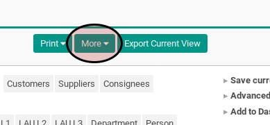
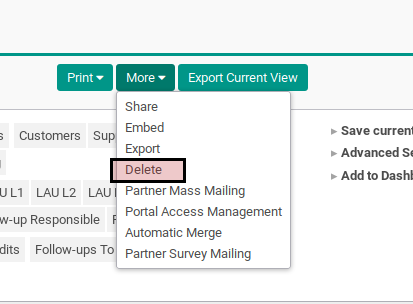
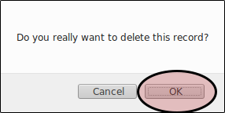

# Menghapus Beberapa Company Partner

## A. INPUT

* Data company partner yang akan dihapus harus belum pernah digunakan dalam transaksi. Apabila data company partner sudah pernah digunakan dalam transaksi lakukan prosedur [Deaktivasi Company Partner](./deaktivasi.md)

## B. LANGKAH KERJA

1. Buka menu **Partner -> Partner -> Company Partner**. Abaikan jika sudah berada pada menu yang dimaksud.
2. Klik tombol **List View Toogle** pada bagian atas-kanan tabel untuk merubah tampilan menjadi list view.

3. Seleksi data company partner yang akan dihapus.
4. Klik tombol **More** pada bagian atas-tengah.

5. Klik tombol **Delete** pada drop-down yang muncul di tombol **More**.

Pop-up konfirmasi penghapusan akan muncul

5. Klik tombol **Ok** pada pop-up konfirmasi penghapusan data.

## C. OUTPUT

* Data company partner akan terhapus
