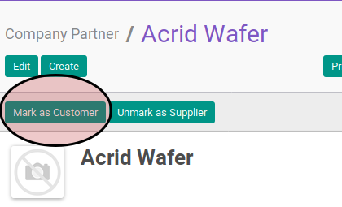

# Menandai Sebagai Konsumen

## A. INPUT

* Data company partner yang akan ditandai sebagai konsumen harus memiliki nilai **Customer** False/Tidak Aktif/Tidak dicheck.

## B. LANGKAH KERJA

1. Buka menu **Partner -> Partner -> Company Partner**. Abaikan jika sudah berada pada menu yang dimaksud.
2. Buka data company partner yang ingin dijadikan sebagai konsumen. Abaikan jika data sudah dibuka.
3. Klik tombol **Mark as Customer** pada bagian atas-kiri form.

## C. OUTPUT

* Nilai **Customer** akan berubah menjadi True/Aktif/Check.
* Data company partner akan dapat dipilih pada fitur sales order, customer invoice, atau credit note.
