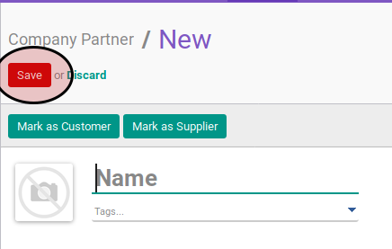

# Membuat Company Partner

## A. INPUT

*tidak ada instruksi khusus*

## B. LANGKAH KERJA

1. Buka menu **Partner -> Partner -> Company Partner**. Abaikan jika sudah berada pada menu yang dimaksud.
2. Klik tombol **Create** pada bagian atas-kiri form

3. Isi **[Name](./penjelasan.md#field-name)**. Harus diisi.
4. Pilih **[Tags](./penjelasan.md#field-tags)**. Tidak harus diisi.
5. Isi **[Address](./penjelasan.md#field-address)**. Tidak harus diisi.
6. Isi **[Website](./penjelasan.md#field-website)**. Tidak harus diisi.
7. Pilih **[Main Sector](./penjelasan.md#field-sector)**. Tidak harus diisi.
8. Isi **[Secondary Sector](./penjelasan.md#field-sector2)**. Tidak harus diisi.
9. Isi **[Phone](./penjelasan.md#field-phone)**. Tidak harus diisi.
10. Isi **[Extension](./penjelasan.md#field-ext)**. Tidak harus diisi.
11. Isi **[Mobile](./penjelasan.md#field-mobile)**. Tidak harus diisi.
12. Isi **[Fax](./penjelasan.md#field-fax)**. Tidak harus diisi.
13. Isi **[Email](./penjelasan.md#field-email)**. Tidak harus diisi.
14. Pilih **[Title](./penjelasan.md#field-title)**. Tidak harus diisi.
15. Pilih **[Ownership Type](./penjelasan.md#field-ownership-type)**. Tidak harus diisi.
16. Beralih ke tab **[Contacts](./penjelasan.md#tab-contacts)**.
17. <a name="l17">[Tambah](./menambah-contact.md)/[Modifikasi](./memodifikasi-contact.md)/[Hapus](./menghapus-contact.md) **Contacts**</a>. Ulangi langkah ini sampai **Contacts** sesuai dengan keinginan.
18. <a name="l18">[Tambah](./menambah-affiliates.md)/[Modifikasi](./memodifikasi-affiliates.md)/[Hapus](./menghapus-affiliates.md) **Affiliates**</a>. Ulangi langkah ini sampai **Affiliates** sesuai dengan keinginan.
19. Beralih ke tab **[Internal Notes](./penjelasan.md#tab-internal-notes)**.
20. Isi **[Internal Notes](./penjelasan.md#field-internal-notes)**. Tidak harus diisi.
21. Beralih ke tab **[Sales & Purchases](./penjelasan.md#tab-sales-purchases)**.
22. Pilih **[Salesperson](./penjelasan.md#field-sale-purchase-user-id)**. Tidak harus diisi.
23. Pilih **[Sales Team](./penjelasan.md#field-sale-purchase-section-id)**. Tidak harus diisi.
24. Pilih **[Company](./penjelasan.md#field-sale-purchase-company)**. Tidak harus diisi.
25. Isi **[Contact Reference](./penjelasan.md#field-sale-ref)**. Tidak harus diisi.
26. Pilih **[Language](./penjelasan.md#field-sale-purchase-language)**. Tidak harus diisi.
27. Pilih **[Date](./penjelasan.md#field-sale-purchase-date)**. Tidak harus diisi.
28. Pilih **[Receive Inbox Notifications by Email](./penjelasan.md#field-sale-purchase-notify-email)**. Tidak harus diisi.
29. Pilih **[Primary Creditor](./penjelasan.md#field-sales-purchases-tabel-cr-primary-creditur)**. Tidak harus diisi.
30. <a name="l30">[Tambah](./menambah-kreditur.md)/[Hapus](./menghapus-creditur.md) **Creditors**</a>. Ulangi langkah ini sampai **Creditors** sesuai dengan keinginan.
31. <a name="l31">[Tambah](./menambah-debitur.md)/[Hapus](./menghapus-debitur.md) **Debitors**</a>. Ulangi langkah ini sampai **Debitors** sesuai dengan keinginan.
32. Pilih **[Sales Pricelist](./penjelasan.md#field-sale-purchase-property-product-pricelist)**. Tidak harus diisi.
33. Pilih **[Purchase Pricelist](./penjelasan.md#field-sale-purchase-property-product-pricelist-purchase)**. Tidak harus diisi.
34. Pilih **[Customer Location](./penjelasan.md#field-sale-purchase-property-stock-customer)**. Tidak harus diisi.
35. Pilih **[Supplier Location](./penjelasan.md#field-sale-purchase-property-stock-supplier)**. Tidak harus diisi.
36. Beralih ke tab **[ID Numbers](./penjelasan.md#tab-id-numbers)**.
37. <a name="l37">[Tambah](./menambah-id-numbers.md)/[Modifikasi](./memodifikasi-id-numbers.md)/[Hapus](./menghapus-id-numbers.md) **ID Numbers**</a>. Ulangi langkah ini sampai **ID Numbers** sesuai dengan keinginan.
38. Beralih ke tab **[Accounting](./penjelasan.md#tab-accounting)**.
39. Pilih **[Fiscal Position](./penjelasan.md#field-accounting-header-property-account-position)**. Tidak harus diisi.
40. Isi **[TIN](./penjelasan.md#field-accounting-header-tin)**. Tidak harus diisi.
41. Pilih **[Account Receivable](./penjelasan.md#field-accounting-header-property-account-receivable)**. Tidak harus diisi.
42. Pilih **[Customer Payment Term](./penjelasan.md#field-accounting-header-property-payment-term)**. Tidak harus diisi.
43. Isi **[Total Receivable](./penjelasan.md#field-accounting-header-credit)**. Tidak harus diisi.
44. Isi **[Credit Limit](./penjelasan.md#field-accounting-header-credit-limit)**. Tidak harus diisi.
45. Pilih **[Latest Full Reconcilliation Date](./penjelasan.md#field-accounting-header-last-reconcile-date)**. Tidak harus diisi.
46. Pilih **[Account Payable](./penjelasan.md#field-accounting-header-property-account-payable)**. Tidak harus diisi.
47. Pilih **[Supplier Payment Term](./penjelasan.md#field-accounting-header-property-supplier-payment-term)**. Tidak harus diisi.
48. Isi **[Total Payable](./penjelasan.md#field-accounting-header-debit)**. Tidak harus diisi.
49. <a name="l49">[Tambah](./menambah-account-number.md)/[Modifikasi](./memodifikasi-account-number.md)/[Hapus](./menghapus-account-number.md) **Account Number**</a>. Ulangi langkah ini sampai **Account Number** sesuai dengan keinginan.
50. Pilih **[PTKP Category](./penjelasan.md#field-accounting-pph21-info-pktp-category)**. Tidak harus diisi.
51. Beralih ke tab **[Geo Localization](./penjelasan.md#tab-geo-localization)**.
52. Pilih **[Grade](./penjelasan.md#field-geo-localization-grade)**. Tidak harus diisi.
53. Pilih **[Activation](./penjelasan.md#field-geo-localization-activation)**. Tidak harus diisi.
54. Pilih **[Implemented By](./penjelasan.md#field-geo-localization-implemented-by)**. Tidak harus diisi.
55. Pilih **[Grade Weight](./penjelasan.md#field-geo-localization-grade-weight)**. Tidak harus diisi.
56. Pilih **[Latest Partner Review](./penjelasan.md#field-geo-localization-latest-partner-review)**. Tidak harus diisi.
57. Pilih **[Next Partner Review](./penjelasan.md#field-geo-localization-next-partner-review)**. Tidak harus diisi.
58. Pilih **[Partnership Date](./penjelasan.md#field-geo-localization-partnership-date)**. Tidak harus diisi.
59. Isi **[Geo Latitude](./penjelasan.md#field-geo-localization-latitude)**. Tidak harus diisi.
60. Isi **[Geo Longitude](./penjelasan.md#field-geo-localization-longitude)**. Tidak harus diisi.
61. Isi **[Geo Localization Date](./penjelasan.md#field-geo-localization-localization-date)**. Tidak harus diisi.
62. Klik tombol **Save** pada bagian atas-kiri form

## C. OUTPUT

* Data company partner akan terbuat
