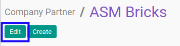

# Memodifikasi Company Partner

## A. INPUT

*(tidak ada instruksi khusus)*

## B. LANGKAH KERJA

1. Buka menu **Partner -> Partner -> Company Partner**. Abaikan jika sudah berada pada menu yang dimaksud.
2. Buka data company partner yang akan dimodifikasi. Abaikan jika data sudah dibuka.
3. Klik tombol **Edit** pada bagian atas-kiri form.

4. Isi dan sesuaikan **[Name](./penjelasan.md#field-name)** jika dibutuhkan. Harus diisi.
5. Pilih dan sesuaikan **[Tags](./penjelasan.md#field-tags)** jika dibutuhkan. Tidak harus diisi.
6. Isi dan sesuaikan **[Address](./penjelasan.md#field-address)** jika dibutuhkan. Tidak harus diisi.
7. Isi dan sesuaikan **[Website](./penjelasan.md#field-website)** jika dibutuhkan. Tidak harus diisi.
8. Pilih dan sesuaikan **[Main Sector](./penjelasan.md#field-sector)** jika dibutuhkan. Tidak harus diisi.
9. Isi dan sesuaikan **[Secondary Sector](./penjelasan.md#field-sector2)** jika dibutuhkan. Tidak harus diisi.
10. Isi dan sesuaikan **[Phone](./penjelasan.md#field-phone)** jika dibutuhkan. Tidak harus diisi.
11. Isi dan sesuaikan **[Extension](./penjelasan.md#field-ext)** jika dibutuhkan. Tidak harus diisi.
12. Isi dan sesuaikan **[Mobile](./penjelasan.md#field-mobile)** jika dibutuhkan. Tidak harus diisi.
13. Isi dan sesuaikan **[Fax](./penjelasan.md#field-fax)** jika dibutuhkan. Tidak harus diisi.
14. Isi dan sesuaikan **[Email](./penjelasan.md#field-email)** jika dibutuhkan. Tidak harus diisi.
15. Pilih dan sesuaikan **[Title](./penjelasan.md#field-title)** jika dibutuhkan. Tidak harus diisi.
16. Pilih dan sesuaikan **[Ownership Type](./penjelasan.md#field-ownership-type)** jika dibutuhkan. Tidak harus diisi.
17. Beralih ke tab **[Contacts](./penjelasan.md#tab-contacts)**.
18. <a name="l18">[Tambah](./menambah-contact.md)/[Modifikasi](./memodifikasi-contact.md)/[Hapus](./menghapus-contact.md) **Contacts**</a>. Ulangi langkah ini sampai **Contacts** sesuai dengan keinginan.
19. <a name="l19">[Tambah](./menambah-affiliates.md)/[Modifikasi](./memodifikasi-affiliates.md)/[Hapus](./menghapus-affiliates.md) **Affiliates**</a>. Ulangi langkah ini sampai **Affiliates** sesuai dengan keinginan.
20. Beralih ke tab **[Internal Notes](./penjelasan.md#tab-internal-notes)**.
21. Isi dan sesuaikan **[Internal Notes](./penjelasan.md#field-internal-notes)** jika dibutuhkan. Tidak harus diisi.
22. Beralih ke tab **[Sales & Purchases](./penjelasan.md#tab-sales-purchases)**.
23. Pilih dan sesuaikan **[Salesperson](./penjelasan.md#field-sale-purchase-user-id)** jika dibutuhkan. Tidak harus diisi.
24. Pilih dan sesuaikan **[Sales Team](./penjelasan.md#field-sale-purchase-section-id)** jika dibutuhkan. Tidak harus diisi.
25. Pilih dan sesuaikan **[Company](./penjelasan.md#field-sale-purchase-company)** jika dibutuhkan. Tidak harus diisi.
26. Isi dan sesuaikan **[Contact Reference](./penjelasan.md#field-sale-ref)** jika dibutuhkan. Tidak harus diisi.
27. Pilih dan sesuaikan **[Language](./penjelasan.md#field-sale-purchase-language)** jika dibutuhkan. Tidak harus diisi.
28. Pilih dan sesuaikan **[Date](./penjelasan.md#field-sale-purchase-date)** jika dibutuhkan. Tidak harus diisi.
29. Pilih dan sesuaikan **[Receive Inbox Notifications by Email](./penjelasan.md#field-sale-purchase-notify-email)** jika dibutuhkan. Tidak harus diisi.
30. Pilih dan sesuaikan **[Primary Creditor](./penjelasan.md#field-sales-purchases-tabel-cr-primary-creditur)** jika dibutuhkan. Tidak harus diisi.
31. <a name="l31">[Tambah](./menambah-kreditur.md)/[Hapus](./menghapus-creditur.md) **Creditors**</a>. Ulangi langkah ini sampai **Creditors** sesuai dengan keinginan.
32. <a name="l32">[Tambah](./menambah-debitur.md)/[Hapus](./menghapus-debitur.md) **Debitors**</a>. Ulangi langkah ini sampai **Debitors** sesuai dengan keinginan.
33. Pilih dan sesuaikan **[Sales Pricelist](./penjelasan.md#field-sale-purchase-property-product-pricelist)** jika dibutuhkan. Tidak harus diisi.
34. Pilih dan sesuaikan **[Purchase Pricelist](./penjelasan.md#field-sale-purchase-property-product-pricelist-purchase)** jika dibutuhkan. Tidak harus diisi.
35. Pilih dan sesuaikan **[Customer Location](./penjelasan.md#field-sale-purchase-property-stock-customer)** jika dibutuhkan. Tidak harus diisi.
36. Pilih dan sesuaikan **[Supplier Location](./penjelasan.md#field-sale-purchase-property-stock-supplier)** jika dibutuhkan. Tidak harus diisi.
37. Beralih ke tab **[ID Numbers](./penjelasan.md#tab-id-numbers)**.
38. <a name="l38">[Tambah](./menambah-id-numbers.md)/[Modifikasi](./memodifikasi-id-numbers.md)/[Hapus](./menghapus-id-numbers.md) **ID Numbers**</a>. Ulangi langkah ini sampai **ID Numbers** sesuai dengan keinginan.
39. Beralih ke tab **[Accounting](./penjelasan.md#tab-accounting)**.
40. Pilih dan sesuaikan**[Fiscal Position](./penjelasan.md#field-accounting-header-property-account-position)** jika dibutuhkan. Tidak harus diisi.
41. Isi dan sesuaikan **[TIN](./penjelasan.md#field-accounting-header-tin)** jika dibutuhkan. Tidak harus diisi.
42. Pilih dan sesuaikan **[Account Receivable](./penjelasan.md#field-accounting-header-property-account-receivable)** jika dibutuhkan. Tidak harus diisi.
43. Pilih dan sesuaikan **[Customer Payment Term](./penjelasan.md#field-accounting-header-property-payment-term)** jika dibutuhkan. Tidak harus diisi.
44. Isi dan sesuaikan **[Total Receivable](./penjelasan.md#field-accounting-header-credit)** jika dibutuhkan. Tidak harus diisi.
45. Isi dan sesuaikan **[Credit Limit](./penjelasan.md#field-accounting-header-credit-limit)** jika dibutuhkan. Tidak harus diisi.
46. Pilih dan sesuaikan **[Latest Full Reconcilliation Date](./penjelasan.md#field-accounting-header-last-reconcile-date)** jika dibutuhkan. Tidak harus diisi.
47. Pilih dan sesuaikan **[Account Payable](./penjelasan.md#field-accounting-header-property-account-payable)** jika dibutuhkan. Tidak harus diisi.
48. Pilih dan sesuaikan **[Supplier Payment Term](./penjelasan.md#field-accounting-header-property-supplier-payment-term)** jika dibutuhkan. Tidak harus diisi.
49. Isi dan sesuaikan **[Total Payable](./penjelasan.md#field-accounting-header-debit)** jika dibutuhkan. Tidak harus diisi.
50. <a name="l50">[Tambah](./menambah-account-number.md)/[Modifikasi](./memodifikasi-account-number.md)/[Hapus](./menghapus-account-number.md) **Account Number**</a>. Ulangi langkah ini sampai **Account Number** sesuai dengan keinginan.
51. Pilih dan sesuaikan **[PTKP Category](./penjelasan.md#field-accounting-pph21-info-pktp-category)** jika dibutuhkan. Tidak harus diisi.
52. Beralih ke tab **[Geo Localization](./penjelasan.md#tab-geo-localization)**.
53. Pilih dan sesuaikan **[Grade](./penjelasan.md#field-geo-localization-grade)** jika dibutuhkan. Tidak harus diisi.
54. Pilih dan sesuaikan **[Activation](./penjelasan.md#field-geo-localization-activation)** jika dibutuhkan. Tidak harus diisi.
55. Pilih dan sesuaikan **[Implemented By](./penjelasan.md#field-geo-localization-implemented-by)** jika dibutuhkan. Tidak harus diisi.
56. Pilih dan sesuaikan **[Grade Weight](./penjelasan.md#field-geo-localization-grade-weight)** jika dibutuhkan. Tidak harus diisi.
57. Pilih dan sesuaikan **[Latest Partner Review](./penjelasan.md#field-geo-localization-latest-partner-review)** jika dibutuhkan. Tidak harus diisi.
58. Pilih dan sesuaikan **[Next Partner Review](./penjelasan.md#field-geo-localization-next-partner-review)** jika dibutuhkan. Tidak harus diisi.
59. Pilih dan sesuaikan **[Partnership Date](./penjelasan.md#field-geo-localization-partnership-date)** jika dibutuhkan. Tidak harus diisi.
60. Isi dan sesuaikan **[Geo Latitude](./penjelasan.md#field-geo-localization-latitude)** jika dibutuhkan. Tidak harus diisi.
61. Isi dan sesuaikan **[Geo Longitude](./penjelasan.md#field-geo-localization-longitude)** jika dibutuhkan. Tidak harus diisi.
62. Isi dan sesuaikan **[Geo Localization Date](./penjelasan.md#field-geo-localization-localization-date)** jika dibutuhkan. Tidak harus diisi.
63. Klik tombol **Save** pada bagian atas-kiri form

## C. OUTPUT

* Data company partner akan berubah sesuai dengan perubahan yang dilakukan
