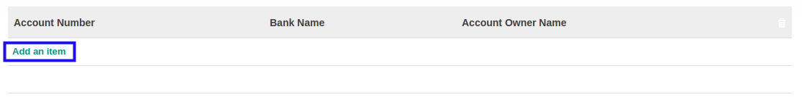
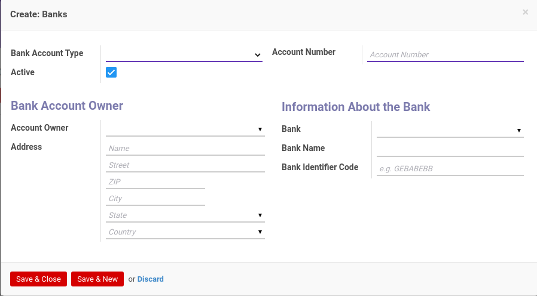

# Menambahkan Account Number

*(Instruksi kerja ini merupakan sub instruksi dari (1) [Membuat Company Partner](./membuat.md), atau (2) [Memodifikasi Company Partner](./memodifikasi.md). Instruksi kerja ini tidak bisa berdiri sendiri)*

## A. INPUT

*(Tidak ada instruksi khusus)*

## B. LANGKAH KERJA

1. Klik label **Add an Item** pada bagian atas-kiri tabel ***Account Number***

Pop-up ***Banks*** akan muncul.

2. Pilih **[Bank Account Type](./penjelasan.md#field-accounting-detail-bank-state)**. Harus diisi.
3. Isi **[Account Number](./penjelasan.md#field-accounting-detail-bank-acc-number)**. Harus diisi.
4. Pilih **[Account Owner](./penjelasan.md#field-accounting-detail-bank-partner-id)**. Tidak harus diisi.
5. Isi **[Address](./penjelasan.md#field-accounting-detail-bank-address)**. Tidak harus diisi.
6. Pilih **[Bank](./penjelasan.md#field-accounting-detail-bank-bank)**. Tidak harus diisi.
7. Isi **[Bank Name](./penjelasan.md#field-accounting-detail-bank-bank_name)**. Tidak harus diisi.
8. Isi **[Bank Identifier Code](./penjelasan.md#field-accounting-detail-bank-bic)**. Tidak harus diisi.
9. Klik tombol **Save & Close** pada bagian bawah-kiri pop-up **Banks** untuk menyimpan data. Klik tombol **Save & New** pada bagian bawah-kiri pop-up **Banks** untuk menyimpan data dan menambahkan data baru.

10. Ulangi langkah ke-2 jika pada langkah ke-9 tombol **Save & New** yang dipilih.
11. Lanjutkan [langkah ke-49 instruksi kerja Membuat Company Partner](./membuat.md#l49) atau [langkah ke-50 instruksi kerja Memodifikasi Company Partner](./memodifikasi.md#l50).

## C. OUTPUT

*(Tidak ada instruksi khusus)*
