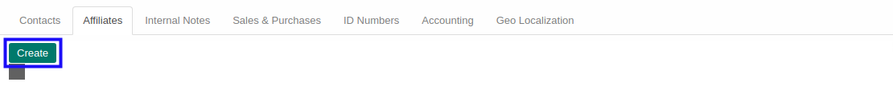
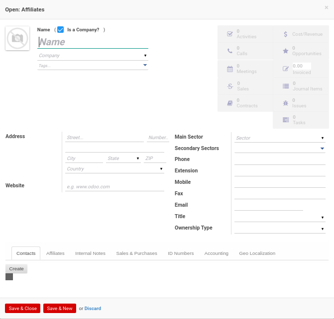

# Menambahkan Afiliasi

*(Instruksi kerja ini merupakan sub instruksi dari (1) [Membuat Company Partner](./membuat.md), atau (2) [Memodifikasi Company Partner](./memodifikasi.md). Instruksi kerja ini tidak bisa berdiri sendiri)*

## A. INPUT

*(Tidak ada instruksi khusus)*

## B. LANGKAH KERJA

1. Klik tombol **Create** pada bagian atas-kiri tab ***Affiliates***

Pop-up ***Affiliates*** akan muncul.

2. Isi **[Name](./penjelasan.md#field-affiliates-name)**. Harus diisi.
3. Pilih **[Company](./penjelasan.md#field-affiliates-company)**. Tidak harus diisi.
4. Pilih **[Tags](./penjelasan.md#field-affiliates-tags)**. Tidak harus diisi.
5. Isi **[Address](./penjelasan.md#field-affiliates-address)**. Tidak harus diisi.
6. Isi **[Website](./penjelasan.md#field-affiliates-website)**. Tidak harus diisi.
7. Pilih **[Main Sector](./penjelasan.md#field-affiliates-sector)**. Tidak harus diisi.
8. Isi **[Secondary Sector](./penjelasan.md#field-affiliates-sector2)**. Tidak harus diisi.
9. Isi **[Phone](./penjelasan.md#field-affiliates-phone)**. Tidak harus diisi.
10. Isi **[Extension](./penjelasan.md#field-affiliates-ext)**. Tidak harus diisi.
11. Isi **[Mobile](./penjelasan.md#field-affiliates-mobile)**. Tidak harus diisi.
12. Isi **[Fax](./penjelasan.md#field-affiliates-fax)**. Tidak harus diisi.
13. Isi **[Email](./penjelasan.md#field-affiliates-email)**. Tidak harus diisi.
14. Pilih **[Title](./penjelasan.md#field-affiliates-title)**. Tidak harus diisi.
15. Pilih **[Ownership Type](./penjelasan.md#field-affiliates-ownership-type)**. Tidak harus diisi.
16. Klik tombol **Save & Close** pada bagian bawah-kiri pop-up **Affiliates** untuk menyimpan data. Klik tombol **Save & New** pada bagian bawah-kiri pop-up **Affiliates** untuk menyimpan data dan menambahkan data baru.

17. Ulangi langkah ke-2 jika pada langkah ke-16 tombol **Save & New** yang dipilih.
18. Lanjutkan [langkah ke-18 instruksi kerja Membuat Company Partner](./membuat.md#l18) atau [langkah ke-19 instruksi kerja Memodifikasi Company Partner](./memodifikasi.md#l19).

## C. OUTPUT

*(Tidak ada instruksi khusus)*
