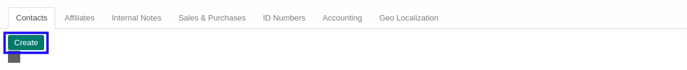

# Menambahkan Contact

*(Instruksi kerja ini merupakan sub instruksi dari (1) [Membuat Company Partner](./membuat.md), atau (2) [Memodifikasi Company Partner](./memodifikasi.md). Instruksi kerja ini tidak bisa berdiri sendiri)*

## A. INPUT

*(Tidak ada instruksi khusus)*

## B. LANGKAH KERJA

1. Klik tombol **Create** pada bagian atas-kiri tab ***Contacts***

Pop-up ***Contacts*** akan muncul.

2. Isi **[Name](./penjelasan.md#field-contact-name)**. Harus diisi.
3. Pilih **[Contact Type](./penjelasan.md#field-contact-type)**. Harus diisi.
4. Pilih **[Tags](./penjelasan.md#field-contact-tags)**. Tidak harus diisi.
5. Pilih **[Categorized Job Position](./penjelasan.md#field-contact-job-category)**. Tidak harus diisi.
6. Isi **[Job Position](./penjelasan.md#field-contact-job-position)**. Tidak harus diisi.
7. Pilih **[Department](./penjelasan.md#field-contact-job-department)**. Tidak harus diisi.
8. Isi **[Email](./penjelasan.md#field-contact-job-email)**. Tidak harus diisi.
9. Isi **[Phone](./penjelasan.md#field-contact-job-phone)**. Tidak harus diisi.
10. Isi **[Extension](./penjelasan.md#field-contact-job-phone-extension)**. Tidak harus diisi.
11. Isi **[Mobile](./penjelasan.md#field-contact-job-mobile)**. Tidak harus diisi.
12. Pilih **[Language](./penjelasan.md#field-contact-job-language)**. Tidak harus diisi.
13. Pilih **[Address Type](./penjelasan.md#field-contact-job-address-type)**. Tidak harus diisi.
14. Klik tombol **Save & Close** pada bagian bawah-kiri pop-up **Contacts** untuk menyimpan data. Klik tombol **Save & New** pada bagian bawah-kiri pop-up **Contacts** untuk menyimpan data dan menambahkan data baru.

15. Ulangi langkah ke-2 jika pada langkah ke-14 tombol **Save & New** yang dipilih.
16. Lanjutkan [langkah ke-17 instruksi kerja Membuat Company Partner](./membuat.md#l17) atau [langkah ke-18 instruksi kerja Memodifikasi Company Partner](./memodifikasi.md#l18).

## C. OUTPUT

*(Tidak ada instruksi khusus)*
