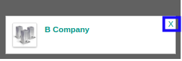

# Menghapus Afiliasi

*(Instruksi kerja ini merupakan sub instruksi dari (1) [Membuat Company Partner](./membuat.md), atau (2) [Memodifikasi Company Partner](./memodifikasi.md). Instruksi kerja ini tidak bisa berdiri sendiri)*

## A. INPUT

*(Tidak ada instruksi khusus)*

## B. INSTRUKSI KERJA

1. Klik icon x pada bagian pojok atas-kanan kotak yang berisi nama *Affiliates*

2. Ulangi langkah ke-1 untuk setiap *Affiliate* yang akan dihapus.
3. Lanjutkan [langkah ke-18 instruksi kerja Membuat Company Partner](./membuat.md#l18) atau [langkah ke-19 instruksi kerja Memodifikasi Company Partner](./memodifikasi.md#l19).

## C. OUTPUT

*(Tidak ada instruksi khusus)*
