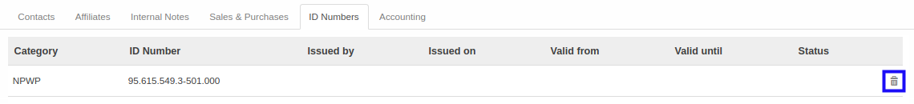

# Menghapus ID Number

*(Instruksi kerja ini merupakan sub instruksi dari (1) [Membuat Company Partner](./membuat.md), atau (2) [Memodifikasi Company Partner](./memodifikasi.md). Instruksi kerja ini tidak bisa berdiri sendiri)*

## A. INPUT

*(Tidak ada instruksi khusus)*

## B. LANGKAH KERJA

1. Klik icon tempat sampah pada bagian kanan data **ID Numbers** yang akan dihapus.

2. Lanjutkan [langkah ke-37 instruksi kerja Membuat Company Partner](./membuat.md#l37) atau [langkah ke-38 instruksi kerja Memodifikasi Company Partner](./memodifikasi.md#l38).

## C. OUTPUT

*(Tidak ada instruksi khusus)*
