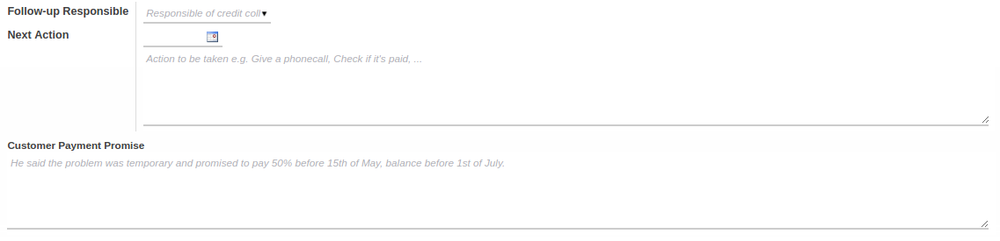

# Penjelasan

Informasi pada Company Partner dibagi menjadi beberapa area, diantaranya:

* [Header](#bagian-header)
* [Tab Contacts](#tab-contacts)
* [Tab Affiliates](#tab-affiliates)
* [Tab Internal Notes](#tab-internal-notes)
* [Tab Sales & Purchases](#tab-sales-purchases)
* [Tab ID Numbers](#tab-id-numbers)
* [Tab Payment Follow-up](#tab-payment-follow-up)
* [Tab Accounting](#tab-accounting)
* [Tab Consignee](#tab-consignee)
* [Tab Point Of Sale](#tab-point-of-sale)

### <a name="bagian-header">HEADER</a>

#### <a name="field-image">Image</a>

 
Foto/gambar untuk logo perusahaan

#### <a name="field-name">Name</a>

Nama Perusahaan

#### <a name="field-tags">Tags</a>

*Tags* Perusahaan

#### <a name="field-smart-button">Smart Button</a>

 

Tombol-tombol yang berfungsi sebagai *Shortcut* untuk masuk ke dalam menu yang berkaitan dan juga sebagai pemberi informasi mengenai seberapa banyak data, total, dll  

#### <a name="field-address">Address</a>

Mendefinisikan alamat. Terbagi atas beberapa isian, yaitu: 
* **Street:** Alamat perusahan
* **Number:** Nomor jalan perusahan
* **City completion:** Informasi kota secara lengkap
* **City:** Kota dimana perusahaan berada
* **State:** Provinsi dimana perusahaan berada
* **Zip:** Nomor kode POS perusahaan
* **Country:** Negara dimana perusahaan berada

#### <a name="field-lau1">Local Admin. Unit 1</a>

Mendefinisikan unit administrasi dimana levelnya adalah 1

#### <a name="field-lau2">Local Admin. Unit 2</a>

Mendefinisikan unit administrasi dimana levelnya adalah 2

#### <a name="field-lau3">Local Admin. Unit 3</a>

Mendefinisikan unit administrasi dimana levelnya adalah 3

#### <a name="field-website">Website</a>

Alamat website perusahaan

#### <a name="field-sector">Main Sector</a>

Bidang usaha utama perusahaan

#### <a name="field-sector2">Secondary Sectors</a>

Bidang usaha kedua perusahaan

#### <a name="field-phone">Phone</a>

Nomor telepon perusahaan

#### <a name="field-mobile">Mobile</a>

Nomor handphone/mobile perusahaan

#### <a name="field-fax">Fax</a>

Nomor fax perusahaan

#### <a name="field-email">Email</a>

Alamat email perusahaan

#### <a name="field-title">Title</a>

Bentuk usaha perusahaan

#### <a name="field-ownership-type">Ownership Type</a>

Tipe kepemilikan perusahaan

### <a name="tab-contacts">TAB CONTACTS</a>

#### <a name="field-contact-image">Image</a>

 
Foto kontak

#### <a name="field-contact-name">Name</a>

Nama kontak

#### <a name="field-contact-type">Contact Type</a>

Tipe kontak. Terbagi atas 2 tipe, yaitu: 
* **Standalone Contact:** Jika dipilih, maka data kontak merupakan data yang berdiri sendiri
* **Attached to existing Contact:** Jika dipilih, maka data kontak terhubung pada data *partner* yang sudah ada

> **Catatan:** Jika tipe *Standalone Contact* dipilih, maka field *Name* akan berupa isian. Jika tipe *Attached to existing Contact* dipilih, maka field *Name* akan berupa pilihan

#### <a name="field-contact-tags">Tags</a>

*Tags* kontak

#### <a name="field-contact-job-posisition">Job Position</a>

Posisi/jabatan kontak

#### <a name="field-contact-job-department">Department</a>

Departemen tempat berkerjanya kontak

#### <a name="field-contact-job-email">Email</a>

Alamat email kontak

#### <a name="field-contact-job-phone">Phone</a>

Nomor telepon kontak

#### <a name="field-contact-job-mobile">Mobile</a>

Nomor handphone/mobile kontak

#### <a name="field-contact-company-address">Use Company Address</a>

Jika dipilih, maka alamat kontak akan menggunakan alamat perusahaan.

#### <a name="field-contact-job-address-type">Address Type</a>

Tipe alamat. Terbagi atas 5 tipe, yaitu: 
* **Default:** Todo
* **Invoice:** Todo
* **Shipping:** Todo
* **Contact:** Todo
* **Other:** Todo

#### <a name="field-contact-lau1">Local Admin. Unit 1</a>

Mendefinisikan unit administrasi dimana levelnya adalah 1

#### <a name="field-contact-lau2">Local Admin. Unit 2</a>

Mendefinisikan unit administrasi dimana levelnya adalah 2

### <a name="tab-affiliates">TAB AFFILIATES</a>

#### <a name="field-affiliates">Affiliates</a>

Mendefinisikan afiliasi

### <a name="tab-internal-notes">TAB INTERNAL NOTES</a>

#### <a name="field-internal-notes">Internal Notes</a>

Catatan internal terkait *Partner*

### <a name="tab-sales-purchases">TAB SALES & PURCHASES</a>

#### <a name="field-sale-purchase-user-id">Salesperson</a>

Mendefinisikan *Salesperson*

#### <a name="field-sale-purchase-section-id">Sales Team</a>

Mendefinisikan *Sales Team*

#### <a name="field-sale-purchase-ref">Contact Reference</a>

Referensi *Partner*

#### <a name="field-sale-purchase-language">Languange</a>

Mendefinisikan bahasa yang digunakan

#### <a name="field-sale-purchase-date">Date</a>

Tanggal

#### <a name="field-sale-purchase-partner-product-ul">Logistic Unit</a>

Mendefinisikan *Logistic Unit*

#### <a name="field-sale-purchase-property-product-pricelist">Sale Pricelist</a>

Mendefinisikan daftar harga penjualan

#### <a name="field-sale-purchase-property-product-pricelist-purchase">Purchase Pricelist</a>

Mendefinisikan daftar harga pembelian

#### <a name="field-sale-purchase-customer">Customer</a>

Jika dipilih, maka *Partner* akan ditandai sebagai *Customer*(Pelanggan)

#### <a name="field-sale-purchase-supplier">Supplier</a>

Jika dipilih, maka *Partner* akan ditandai sebagai *Supplier*(Pemasok)

#### <a name="field-sale-purchase-actice">Active</a>

Sebagai penanda apakah data adalah aktif/non-aktif

#### <a name="field-sale-purchase-publish">Publish</a>

Jika dipilih, maka *Partner* akan ter-*publish* pada website 

#### <a name="field-sale-purchase-opt-out">Opt-Out</a>

Jika dipilih, maka *Partner* tidak akan menerima email untuk *Mass Mailing* dan *Marketing Campaign*

#### <a name="field-sale-purchase-notify-email">Receive Inbox Notifications by Email</a>

Terbagi atas 2 pilihan, yaitu: 
* **Never:** Jika dipilih, *Partner* tidak akan menerima notifikasi email
* **All Messages:** Jika dipilih, *Partner* akan menerima notifikasi email

#### <a name="field-sale-purchase-property-stock-customer">Customer Location</a>

Mendefinisikan lokasi *Customer*(Pelanggan)

#### <a name="field-sale-purchase-property-stock-customer-promotion">Customer Promotion Location</a>

Mendefinisikan lokasi *Customer Promotion*(Promosi Pelanggan)

#### <a name="field-sale-purchase-property-stock-supplier-promotion">Supplier Promotion Location</a>

Mendefinisikan lokasi *Supplier Promotion*(Promosi Pemasok)

#### <a name="field-sale-purchase-property-stock-supplier">Supplier Location</a>

Mendefinisikan lokasi *Supplier*(Pemasok)

#### <a name="field-sale-purchase-property-delivery-carrier">Delivery Method</a>

Mendefinisikan metode pengiriman yang digunakan

### <a name="tab-id-numbers">TAB ID NUMBERS</a>

#### <a name="field-id-number-category-id">Category</a>

Mendefinisikan kategori dari nomor identitas yang akan digunakan 
*Ex:* SIM, KTP

#### <a name="field-id-number-name">ID Number</a>

Nomor identitas

#### <a name="field-id-number-partner-issued-id">Issued By</a>

Mendefinisikan siapa yang mengeluarkan nomor identitas

#### <a name="field-id-number-partner-date-issued">Issued On</a>

Mendefinisikan tanggal identitas dikeluarkan

#### <a name="field-id-number-place-issuance">Place of Issuance</a>

Mendefinisikan tempat diterbitkannya nomor identitas

#### <a name="field-id-number-valid-from">Valid From</a>

Mendefinisikan tanggal mulai validnya nomor identitas

#### <a name="field-id-number-valid-Until">Valid Until</a>

Mendefinisikan tanggal akhir validnya nomor identitas

#### <a name="field-id-number-status">Status</a>

Mendefinisikan status identitas. Terbagi atas 4 pilihan, yaitu: 
* **New:** Identitas baru
* **Running:** Identitas yang sedang berjalan
* **To Renew:** Identitas perlu diperpanjang
* **Expired:** Identitas sudah tidak aktif

#### <a name="field-id-number-notes">Notes</a>

Catatan tambahan terkait nomor identitas

### <a name="tab-payment-follow-up">TAB PAYMENT FOLLOW-UP</a>

### <a name="tab-payment-follow-up-header">HEADER</a>

#### <a name="field-payment-follow-up-payment-responsible-id">Follow-up Responsible</a>

Mendefinisikan *User* yang akan bertanggung jawab untuk melakukan *Follow-up* pembayaran

#### <a name="field-payment-follow-up-payment-next-action">Next Action</a>

Mendefinisikan tanggal tindakan selajutnya beserta catatan terkait tindakan yang akan dilakukan

#### <a name="field-payment-follow-up-note">Customer Payment Promise</a>

Isian untuk janji pembayaran yang diberikan oleh *Customer*(Pelanggan)

### <a name="tab-payment-follow-up-history">HISTORY</a>

#### <a name="field-payment-follow-up-history">History</a>

Todo

### <a name="tab-accounting">TAB ACCOUNTING</a>

### <a name="tab-accounting-header">HEADER</a>

#### <a name="tab-accounting-header-property-account-position">Fiscal Position</a>

Terbagi atas 2 pilihan, yaitu: 
* **Normal Taxes:** Todo
* **Tax Exempt:** Todo

#### <a name="tab-accounting-header-tin">TIN</a>

Mendefiniskan dan melakukan pengecekan terkait nomor identifikasi pajak. 

> **Catatan:** TIN(Inggris: *Tax Identification Number* disingkat TIN)

#### <a name="tab-accounting-header-property-account-receivable">Account Receivable</a>

Mendefiniskan akun piutang dagang

#### <a name="tab-accounting-header-property-payment-term">Customer Payment Term</a>

Mendefiniskan jangka waktu pembayaran *Customer*(Pelanggan)

#### <a name="tab-accounting-header-credit">Total Receivable</a>

Informasi terkait total piutang

#### <a name="tab-accounting-header-debt">Debt</a>

Informasi terkait hutang

#### <a name="tab-accounting-header-last-reconcile-date">Latest Full Reconciliation Date</a>

Todo

#### <a name="tab-accounting-header-property-account-payable">Account Payable</a>

Mendefiniskan akun piutang hutang

#### <a name="tab-accounting-header-property-supplier-payment-term">Supplier Payment Term</a>

Mendefiniskan jangka waktu pembayaran *Supplier*(Pemasok)

#### <a name="tab-accounting-header-debit">Total Payable</a>

Informasi terkait total yang harus dibayar

### <a name="tab-accounting-detail-bank">DETAIL BANK</a>

#### <a name="tab-accounting-detail-bank-state">Bank Account Type</a>

Tipe akun bank

#### <a name="tab-accounting-detail-bank-acc-number">Account Number</a>

Nomor akun bank

#### <a name="tab-accounting-detail-bank-partner-id">Account Owner</a>

Pemilik akun bank

#### <a name="tab-accounting-detail-bank-address">Address</a>

Alamat Bank. Terbagi atas beberapa isian, yaitu: 
* Name - Nama pemilik akun bank
* Street - Alamat akun bank
* Zip - Nomor kode POS akun bank
* City - Kota akun bank
* State - Provinsi akun bank
* Country - Negara akun bank

#### <a name="tab-accounting-detail-bank-bank">Bank</a>

Mendefinisikan bank yang akan digunakan

#### <a name="tab-accounting-detail-bank-bank_name">Bank Name</a>

Nama bank

#### <a name="tab-accounting-detail-bank-bic">Bank Identifier Code</a>

Kode bank

### <a name="tab-accounting-pph21-info">PPH21 Information</a>

#### <a name="tab-accounting-pph21-info-pktp-category">PKTP Category</a>

Mendefiniskan kategori PTKP(Penghasilan Tidak Kena Pajak)

### <a name="tab-consignee">TAB CONSIGNEE</a>

#### <a name="tab-consignee-is-consignee">Consignee</a>

Jika dipilih, maka *Partner* merupakan penerima barang

### <a name="tab-point-of-sale">TAB POINT OF SALE</a>

#### <a name="tab-point-of-sale-available-in-pos">Available for POS</a>

Jika dipilih, maka data *Partner* akan tersedia pada POS

#### <a name="tab-point-of-sale-EAN13">EAN13</a>

Mendefiniskan nomor barcode