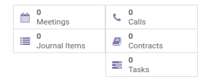
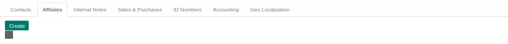
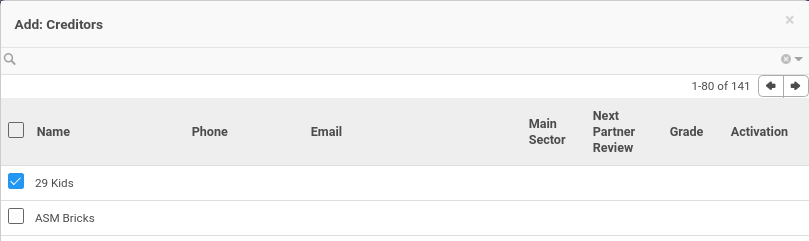

# Penjelasan

Informasi pada Company Partner dibagi menjadi beberapa area, diantaranya:

* [Header](#bagian-header)
* [Tab Contacts](#tab-contacts)
* [Tab Affiliates](#tab-affiliates)
* [Tab Internal Notes](#tab-internal-notes)
* [Tab Sales & Purchases](#tab-sales-purchases)
* [Tab ID Numbers](#tab-id-numbers)
* [Tab Accounting](#tab-accounting)
* [Tab Geo Localization](#tab-geo-localization)

### <a name="bagian-header">HEADER</a>

#### <a name="field-image">Image</a>

 

Foto/gambar untuk logo perusahaan

#### <a name="field-name">Name</a>

Nama Perusahaan

#### <a name="field-tags">Tags</a>

*Tags* Perusahaan

#### <a name="field-smart-button">Smart Button</a>

 

Tombol-tombol yang berfungsi sebagai *Shortcut* untuk masuk ke dalam menu yang berkaitan dan juga sebagai pemberi informasi mengenai seberapa banyak data, total, dll  

#### <a name="field-address">Address</a>

Alamat terbagi atas beberapa isian, yaitu: 
* **Street:** Alamat perusahan
* **Number:** Nomor jalan perusahan
* **City completion:** Informasi kota secara lengkap
* **City:** Kota dimana perusahaan berada
* **State:** Provinsi dimana perusahaan berada
* **Zip:** Nomor kode POS perusahaan
* **Country:** Negara dimana perusahaan berada

#### <a name="field-website">Website</a>

Alamat website perusahaan

#### <a name="field-sector">Main Sector</a>

Bidang usaha utama perusahaan

#### <a name="field-sector2">Secondary Sectors</a>

Bidang usaha kedua perusahaan

#### <a name="field-phone">Phone</a>

Nomor telepon perusahaan

#### <a name="field-ext">Extension</a>

Nomor telepon extension perusahaan

#### <a name="field-mobile">Mobile</a>

Nomor handphone/mobile perusahaan

#### <a name="field-fax">Fax</a>

Nomor fax perusahaan

#### <a name="field-email">Email</a>

Alamat email perusahaan

#### <a name="field-title">Title</a>

Bentuk usaha perusahaan

#### <a name="field-ownership-type">Ownership Type</a>

Tipe kepemilikan perusahaan

### <a name="tab-contacts">TAB CONTACTS</a>

#### <a name="field-contact-image">Image</a>

 

Foto kontak

#### <a name="field-contact-name">Name</a>

Nama kontak

#### <a name="field-contact-type">Contact Type</a>

Tipe kontak. Terbagi atas 2 tipe, yaitu: 
* **Standalone Contact:** Jika dipilih, maka data kontak merupakan data yang berdiri sendiri
* **Attached to existing Contact:** Jika dipilih, maka data kontak terhubung pada data *partner* yang sudah ada

> **Catatan:** Jika tipe *Standalone Contact* dipilih, maka field *Name* akan berupa isian. Jika tipe *Attached to existing Contact* dipilih, maka field *Name* akan berupa pilihan

#### <a name="field-contact-tags">Tags</a>

*Tags* kontak

#### <a name="field-contact-job-category">Categorized Job Position</a>

Kategori Posisi/jabatan kontak

#### <a name="field-contact-job-position">Job Position</a>

Posisi/jabatan kontak

#### <a name="field-contact-job-department">Department</a>

Departemen tempat bekerjanya kontak

#### <a name="field-contact-job-email">Email</a>

Alamat email kontak

#### <a name="field-contact-job-phone">Phone</a>

Nomor telepon kontak

#### <a name="field-contact-job-phone-ext">Extension</a>

Nomor telepon extension kontak

#### <a name="field-contact-job-mobile">Mobile</a>

Nomor handphone/mobile kontak

#### <a name="field-contact-job-language">Language</a>

Bahasa yang digunakan

#### <a name="field-contact-company-address">Use Company Address</a>

Jika dipilih, maka alamat kontak akan menggunakan alamat perusahaan.

#### <a name="field-contact-job-address-type">Address Type</a>

Tipe alamat. Terbagi atas 5 tipe, yaitu: 
* **Default:** Todo
* **Invoice:** Todo
* **Shipping:** Todo
* **Contact:** Todo
* **Other:** Todo

### <a name="tab-affiliates">TAB AFFILIATES</a>

#### <a name="field-affiliates-image">Image</a>

 

Foto/gambar untuk logo perusahaan afiliasi

#### <a name="field-affiliates-name">Name</a>

Nama perusahaan afiliasi

#### <a name="field-affiliates-company">Company</a>

Nama perusahaan

#### <a name="field-affiliates-tags">Tags</a>

*Tags* perusahaan afiliasi

#### <a name="field-affiliates-address">Address</a>

Alamat terbagi atas beberapa isian, yaitu: 
* **Street:** Alamat perusahan afiliasi
* **Number:** Nomor jalan perusahan afiliasi
* **City completion:** Informasi kota secara lengkap
* **City:** Kota dimana perusahaan afiliasi berada
* **State:** Provinsi dimana perusahaan afiliasi berada
* **Zip:** Nomor kode POS perusahaan afiliasi
* **Country:** Negara dimana perusahaan afiliasi berada

#### <a name="field-affiliates-website">Website</a>

Alamat website perusahaan afiliasi

#### <a name="field-affiliates-sector">Main Sector</a>

Bidang usaha utama perusahaan afiliasi

#### <a name="field-affiliates-sector2">Secondary Sectors</a>

Bidang usaha kedua perusahaan afiliasi

#### <a name="field-affiliates-phone">Phone</a>

Nomor telepon perusahaan afiliasi

#### <a name="field-affiliates-ext">Extension</a>

Nomor telepon extension perusahaan afiliasi

#### <a name="field-affiliates-mobile">Mobile</a>

Nomor handphone/mobile perusahaan afiliasi

#### <a name="field-affiliates-fax">Fax</a>

Nomor fax perusahaan afiliasi

#### <a name="field-affiliates-email">Email</a>

Alamat email perusahaan afiliasi

#### <a name="field-affiliates-title">Title</a>

Bentuk usaha perusahaan afiliasi

#### <a name="field-affiliates-ownership-type">Ownership Type</a>

Tipe kepemilikan perusahaan afiliasi

### <a name="tab-internal-notes">TAB INTERNAL NOTES</a>

#### <a name="field-internal-notes">Internal Notes</a>

Catatan internal terkait *Partner*

### <a name="tab-sales-purchases">TAB SALES & PURCHASES</a>

#### <a name="field-sale-purchase-user-id">Salesperson</a>

Nama *Salesperson*

#### <a name="field-sale-purchase-section-id">Sales Team</a>

Nama *Sales Team*

#### <a name="field-sale-purchase-company">Company</a>

Nama perusahaan

#### <a name="field-sale-purchase-ref">Contact Reference</a>

Referensi *Partner*

#### <a name="field-sale-purchase-language">Languange</a>

Bahasa yang digunakan

#### <a name="field-sale-purchase-date">Date</a>

Tanggal

#### <a name="field-sale-purchase-customer">Customer</a>

Jika dipilih, maka *Partner* akan ditandai sebagai *Customer* (Pelanggan)

#### <a name="field-sale-purchase-supplier">Supplier</a>

Jika dipilih, maka *Partner* akan ditandai sebagai *Supplier* (Pemasok)

#### <a name="field-sale-purchase-active">Active</a>

Sebagai penanda apakah data adalah aktif/non-aktif

#### <a name="field-sale-purchase-publish">Publish</a>

Jika dipilih, maka *Partner* akan ter-*publish* pada website

#### <a name="field-sale-purchase-opt-out">Opt-Out</a>

Jika dipilih, maka *Partner* tidak akan menerima email untuk *Mass Mailing* dan *Marketing Campaign*

#### <a name="field-sale-purchase-notify-email">Receive Inbox Notifications by Email</a>

Terbagi atas 2 pilihan, yaitu: 
* **Never:** Jika dipilih, *Partner* tidak akan menerima notifikasi email
* **All Messages:** Jika dipilih, *Partner* akan menerima notifikasi email

### <a name="tab-sales-purchases-cr">TABEL CREDITORS</a>

#### <a name="field-sales-purchases-tabel-cr-primary-creditur">Primary Creditur</a>

Nama kreditur utama

### <a name="tab-sales-purchases-tabel-cr-detail">DETAIL CREDITORS</a>

#### <a name="field-sales-purchases-tabel-cr-name">Name</a>

Nama kreditur

#### <a name="field-sales-purchases-tabel-cr-phone">Phone</a>

Nomor telepon kreditur

#### <a name="field-sales-purchases-tabel-cr-email">Email</a>

Alamat email kreditur

#### <a name="field-sales-purchases-tabel-cr-main-sector">Main Sector</a>

Sektor utama kreditur

#### <a name="field-sales-purchases-tabel-cr-partner-review">Next Partner Review</a>

Todo

#### <a name="field-sales-purchases-tabel-cr-grade">Grade</a>

Todo

#### <a name="field-sales-purchases-tabel-cr-activation">Activation</a>

Todo

### <a name="tab-sales-purchases-tabel-db">TABEL DEBITORS</a>

### <a name="tab-sales-purchases-tabel-db-detail">DETAIL DEBITORS</a>

#### <a name="field-sales-purchases-tabel-db-name">Name</a>

Nama debitur

#### <a name="field-sales-purchases-tabel-db-phone">Phone</a>

Nomor telepon debitur

#### <a name="field-sales-purchases-tabel-db-email">Email</a>

Alamat email debitur

#### <a name="field-sales-purchases-tabel-db-main-sector">Main Sector</a>

Sektor utama debitur

#### <a name="field-sales-purchases-tabel-db-partner-review">Next Partner Review</a>

Todo

#### <a name="field-sales-purchases-tabel-db-grade">Grade</a>

Todo

#### <a name="field-sales-purchases-tabel-db-activation">Activation</a>

Todo

### <a name="tab-sales-purchases-pricelist">OTHERS</a>

#### <a name="field-sale-purchase-property-product-pricelist">Sale Pricelist</a>

Daftar harga penjualan

#### <a name="field-sale-purchase-property-product-pricelist-purchase">Purchase Pricelist</a>

Daftar harga pembelian

#### <a name="field-sale-purchase-property-stock-customer">Customer Location</a>

Lokasi *Customer* (Pelanggan)

#### <a name="field-sale-purchase-property-stock-supplier">Supplier Location</a>

Lokasi *Supplier* (Pemasok)

### <a name="tab-id-numbers">TAB ID NUMBERS</a>

#### <a name="field-id-number-category-id">Category</a>

Kategori dari nomor identitas yang akan digunakan 
*Ex:* SIM, KTP

#### <a name="field-id-number-name">ID Number</a>

Nomor identitas

#### <a name="field-id-number-partner-issued-id">Issued By</a>

Informasi yang mengeluarkan nomor identitas

#### <a name="field-id-number-partner-date-issued">Issued On</a>

Tanggal identitas dikeluarkan

#### <a name="field-id-number-place-issuance">Place of Issuance</a>

Tempat diterbitkannya nomor identitas

#### <a name="field-id-number-valid-from">Valid From</a>

Tanggal mulai validnya nomor identitas

#### <a name="field-id-number-valid-Until">Valid Until</a>

Tanggal akhir validnya nomor identitas

#### <a name="field-id-number-status">Status</a>

Status identitas. Terbagi atas 4 pilihan, yaitu: 
* **New:** Identitas baru
* **Running:** Identitas yang sedang berjalan
* **To Renew:** Identitas perlu diperpanjang
* **Expired:** Identitas sudah tidak aktif

#### <a name="field-id-number-notes">Notes</a>

Catatan tambahan terkait nomor identitas

### <a name="tab-accounting">TAB ACCOUNTING</a>

### <a name="tab-accounting-header">HEADER</a>

#### <a name="tab-accounting-header-property-account-position">Fiscal Position</a>

Terbagi atas 2 pilihan, yaitu: 
* **Normal Taxes:** Todo
* **Tax Exempt:** Todo

#### <a name="tab-accounting-header-tin">TIN</a>

Pengecekan terkait nomor identifikasi pajak.

> **Catatan:** TIN(Inggris: *Tax Identification Number* disingkat TIN)

#### <a name="tab-accounting-header-property-account-receivable">Account Receivable</a>

Akun piutang dagang

#### <a name="tab-accounting-header-property-payment-term">Customer Payment Term</a>

Jangka waktu pembayaran *Customer* (Pelanggan)

#### <a name="tab-accounting-header-credit">Total Receivable</a>

Informasi terkait total piutang

#### <a name="tab-accounting-header-credit-limit">Credit Limit</a>

Informasi batas kredit

#### <a name="tab-accounting-header-last-reconcile-date">Latest Full Reconciliation Date</a>

Todo

#### <a name="tab-accounting-header-property-account-payable">Account Payable</a>

Akun piutang hutang

#### <a name="tab-accounting-header-property-supplier-payment-term">Supplier Payment Term</a>

Jangka waktu pembayaran *Supplier* (Pemasok)

#### <a name="tab-accounting-header-debit">Total Payable</a>

Informasi terkait total yang harus dibayar

### <a name="tab-accounting-detail-bank">DETAIL BANK</a>

#### <a name="tab-accounting-detail-bank-state">Bank Account Type</a>

Tipe akun bank

#### <a name="tab-accounting-detail-bank-acc-number">Account Number</a>

Nomor akun bank

#### <a name="tab-accounting-detail-bank-partner-id">Account Owner</a>

Pemilik akun bank

#### <a name="tab-accounting-detail-bank-address">Address</a>

Alamat Bank. Terbagi atas beberapa isian, yaitu: 
* Name - Nama pemilik akun bank
* Street - Alamat akun bank
* Zip - Nomor kode POS akun bank
* City - Kota akun bank
* State - Provinsi akun bank
* Country - Negara akun bank

#### <a name="tab-accounting-detail-bank-bank">Bank</a>

Bank yang akan digunakan

#### <a name="tab-accounting-detail-bank-bank_name">Bank Name</a>

Nama bank

#### <a name="tab-accounting-detail-bank-bic">Bank Identifier Code</a>

Kode bank

### <a name="tab-accounting-pph21-info">PPH21 Information</a>

#### <a name="tab-accounting-pph21-info-pktp-category">PKTP Category</a>

Kategori PTKP (Penghasilan Tidak Kena Pajak)

### <a name="tab-geo-localization">TAB GEO LOCALIZATION</a>

#### <a name="field-geo-localization-grade">Grade</a>

Todo

#### <a name="field-geo-localization-activation">Activation</a>

Todo

#### <a name="field-geo-localization-implemented-by">Implemented By</a>

Todo

#### <a name="field-geo-localization-grade-weight">Grade Weight</a>

Todo

#### <a name="field-geo-localization-latest-partner-review">Latest Partner Review</a>

Todo

#### <a name="field-geo-localization-next-partner-review">Next Partner Review</a>

Todo

#### <a name="field-geo-localization-partnership-date">Partnership Date</a>

Todo

#### <a name="field-geo-localization-latitude">Geo Latitude</a>

Posisi latitude Lokasi

#### <a name="field-geo-localization-longitude">Geo Longitude</a>

Posisi longitude Lokasi

#### <a name="field-geo-localization-localization-date">Geo Localization Date</a>

Tanggal Geo Localization
