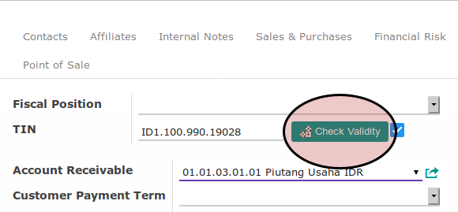

# Petunjuk Pengisian Informasi Usaha

1. Perhatikan bagian **Header**
2. Pilih **Main Sector**. Tidak harus diisi.
3. Pilih **Secondary Sector**. Tidak harus diisi.
4. Pilih **Title**. Tidak harus diisi.
5. Pilih **Ownership Type**. Tidak harus diisi.
6. Buka tab **Accounting**. Tidak harus diisi.
7. Isi **TIN**. Tidak harus diisi.
8. Klik tombol **Check Validity** paba sebelah kanan isian **TIN**

