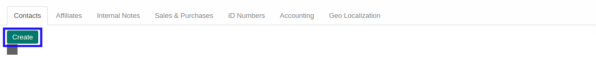
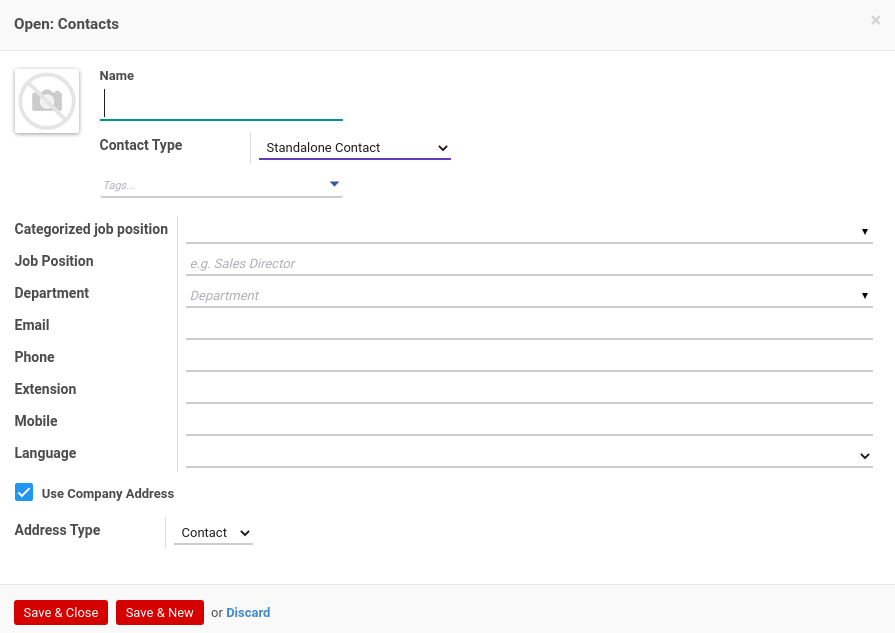
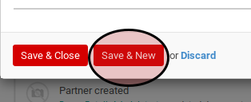
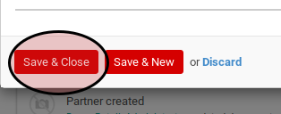
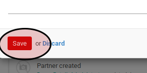
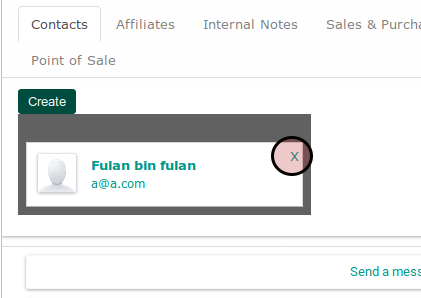

# Petunjuk Pengisian Nara Hubung Company Partner

## Pembuatan Data Nara Hubung Baru

1. Buka tab **Contacts**.
2. <a name="l2">Klik</a> tombol **Create** pada bagian atas-kanan kanban **Contacts**

Pop-up **Contacts** akan muncul

3. Lakukan [Pengisian Data Nara Hubung](#pengisian)
4. Klik tombol **Save & Close** atau **Save & New** untuk menyimpan data. Ulangi [langkah ke-2](#l2) apabila **Save & New** yang dipilih.

## <a name="sunting">Penyuntingan Data Nara Hubung</a>

1. Buka tab **Contacts**.
2. Klik data nara hubung yang ingin disunting

Pop-up **Contacts** akan muncul

3. Lakukan [Pengisian Data Nara Hubung](#pengisian)
4. Klik tombol **Save** untuk menyimpan data.

## <a name="hapus">Penghapusan Data Nara Hubung</a>

1. Buka tab **Contacts**.
2. Klik icon x pada data nara hubung yang ingin dihapus

## <a name="pengisian">Pengisian Data Nara Hubung</a>

1. Pilih **Contact Type**. Lanjutkan langkah ke-3 apabila **Standalone Contact** yang dipilih. Lanjutkan ke langkah ke-4 apabila **Attach to Existing Contact** yang dipilih.
2. Isi **Name**. Harus diisi.
3. Pilih **Name**. Harus diisi.
4. Pilih **Tags**. Tidak harus diisi.
5. Isi **Job Position**. Tidak harus diisi.
6. Pilih **Department**. Tidak harus diisi.
7. Isi **Email**. Tidak harus diisi.
8. Isi **Phone**. Tidak harus diisi.
9. Isi **Mobile**. Tidak harus diisi.
10. Aktifkan **Use Company Address**.
11. Pastikan pilihan **Address Type** adalah **Contact**
