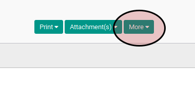
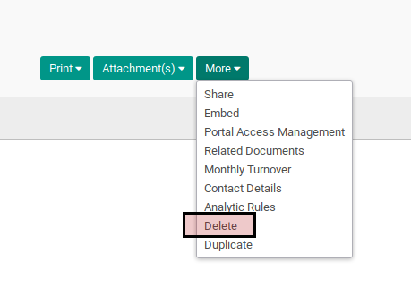

# Menghapus Individual Partner Satu Per Satu

## A. INPUT

* Data individual partner yang akan dihapus harus belum pernah digunakan dalam transaksi. Apabila data individual partner sudah pernah digunakan dalam transaksi lakukan prosedur [Deaktivasi Individual Partner](./deaktivasi.md)

## B. LANGKAH KERJA

1. Buka menu **Partner -> Partner -> Individual Partner**. Abaikan jika sudah berada pada menu yang dimaksud.
2. Buka data individual partner yang akan dihapus. Abaikan jika data sudah dibuka.
3. Klik tombol **More** pada bagian atas-tengah form

4. Klik tombol **Delete** pada drop-down yang muncul di tombol **More**

Pop-up konfirmasi penghapusan akan muncul

5. Klik tombol **Ok** pada pop-up konfirmasi penghapusan data.

## C. OUTPUT

* Data individual partner akan terhapus
