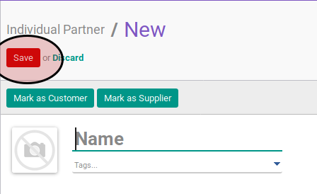

# Membuat Individual Partner

## A. INPUT

*tidak ada instruksi khusus*

## B. LANGKAH KERJA

1. Buka menu **Partner -> Partner -> Individual Partner**.
2. Klik tombol **Create** pada bagian atas-kiri form

3. Isi **[Name](./penjelasan.md#field-name)**. Harus diisi.
4. Pilih **[Tags](./penjelasan.md#field-tags)**. Tidak harus diisi.
5. Isi **[Address](./penjelasan.md#field-address)**. Tidak harus diisi.
6. Isi **[Website](./penjelasan.md#field-website)**. Tidak harus diisi.
7. Pilih **[Categorized Job Position](./penjelasan.md#field-category-function)**. Tidak harus diisi.
8. Isi **[Job Position](./penjelasan.md#field-function)**. Tidak harus diisi.
9. Pilih **[Department](./penjelasan.md#field-department)**. Tidak harus diisi.
10. Isi **[Phone](./penjelasan.md#field-phone)**. Tidak harus diisi.
11. Isi **[Extension](./penjelasan.md#field-ext)**. Tidak harus diisi.
12. Isi **[Mobile](./penjelasan.md#field-mobile)**. Tidak harus diisi.
13. Isi **[Fax](./penjelasan.md#field-fax)**. Tidak harus diisi.
14. Isi **[Email](./penjelasan.md#field-email)**. Tidak harus diisi.
15. Pilih **[Title](./penjelasan.md#field-title)**. Tidak harus diisi.
16. Pilih **[Job Level](./penjelasan.md#field-job-level)**. Tidak harus diisi.
17. Pilih **[Latest Formal Level Education](./penjelasan.md#field-formal-education-level-id)**. Tidak harus diisi.
18. Pilih **[Latest Field of Study](./penjelasan.md#field-field-of-study)**. Tidak harus diisi.
19. Isi **[Latest GPA](./penjelasan.md#field-gpa)**. Tidak harus diisi.
20. Isi **[Latest Diploma](./penjelasan.md#field-diploma)**. Tidak harus diisi.
21. Pilih **[Field of Work](./penjelasan.md#field-field-of-work)**. Tidak harus diisi.
22. Beralih ke tab **[Other Positions](./penjelasan.md#tab-other-positions)**.
23. <a name="l23">[Tambah](./menambah-other-positions.md)/[Modifikasi](./memodifikasi-other-positions.md)/[Hapus](./menghapus-other-positions.md) **Other Positions**</a>. Ulangi langkah ini sampai **Other Positions** sesuai dengan keinginan.
24. Beralih ke tab **[Internal Notes](./penjelasan.md#tab-internal-notes)**.
25. Isi **[Internal Notes](./penjelasan.md#field-internal-notes)**. Tidak harus diisi.
26. Beralih ke tab **[Personal Information](./penjelasan.md#tab-personal-information)**.
27. Pilih **[Birthdate](./penjelasan.md#field-personal-information-birthdate)**. Tidak harus diisi.
28. Isi **[Place of Birth](./penjelasan.md#field-personal-information-birthplace)**. Tidak harus diisi.
29. Isi **[Nationality](./penjelasan.md#field-personal-information-nationality)**. Tidak harus diisi.
30. Isi **[Gender](./penjelasan.md#field-personal-information-gender)**. Tidak harus diisi.
31. Isi **[Ethnicity](./penjelasan.md#field-personal-information-ethnicity)**. Tidak harus diisi.
32. Isi **[Blood Type (ABO)](./penjelasan.md#field-personal-information-blood-abo)**. Tidak harus diisi.
33. Isi **[Blood Type (Rh)](./penjelasan.md#field-personal-information-blood-rh)**. Tidak harus diisi.
34. Isi **[Religion](./penjelasan.md#field-personal-information-religion)**. Tidak harus diisi.
35. Beralih ke tab **[Sales & Purchases](./penjelasan.md#tab-sales-purchases)**.
36. Pilih **[Salesperson](./penjelasan.md#field-sale-purchase-user-id)**. Tidak harus diisi.
37. Pilih **[Sales Team](./penjelasan.md#field-sale-purchase-sales-team)**. Tidak harus diisi.
38. Pilih **[Company](./penjelasan.md#field-sale-purchase-company)**. Tidak harus diisi.
39. Isi **[Contact Reference](./penjelasan.md#field-sale-ref)**. Tidak harus diisi.
40. Pilih **[Language](./penjelasan.md#field-sale-purchase-language)**. Tidak harus diisi.
41. Pilih **[Date](./penjelasan.md#field-sale-purchase-date)**. Tidak harus diisi.
42. Pilih **[Receive Inbox Notifications by Email](./penjelasan.md#field-sale-purchase-notify-email)**. Tidak harus diisi.
43. Pilih **[Primary Creditor](./penjelasan.md#field-sales-purchases-tabel-cr-primary-creditur)**. Tidak harus diisi.
44. <a name="l44">[Tambah](./menambah-kreditur.md)/[Hapus](./menghapus-creditur.md) **Creditors**</a>. Ulangi langkah ini sampai **Creditors** sesuai dengan keinginan.
45. <a name="l45">[Tambah](./menambah-debitur.md)/[Hapus](./menghapus-debitur.md) **Debitors**</a>. Ulangi langkah ini sampai **Debitors** sesuai dengan keinginan.
46. Pilih **[Sales Pricelist](./penjelasan.md#field-sale-purchase-property-product-pricelist)**. Tidak harus diisi.
47. Pilih **[Purchase Pricelist](./penjelasan.md#field-sale-purchase-property-product-pricelist-purchase)**. Tidak harus diisi.
48. Pilih **[Customer Location](./penjelasan.md#field-sale-purchase-property-stock-customer)**. Tidak harus diisi.
49. Pilih **[Supplier Location](./penjelasan.md#field-sale-purchase-property-stock-supplier)**. Tidak harus diisi.
50. Beralih ke tab **[ID Numbers](./penjelasan.md#tab-id-numbers)**.
51. <a name="l51">[Tambah](./menambah-id-numbers.md)/[Modifikasi](./memodifikasi-id-numbers.md)/[Hapus](./menghapus-id-numbers.md) **ID Numbers**</a>. Ulangi langkah ini sampai **ID Numbers** sesuai dengan keinginan.
52. Beralih ke tab **[Accounting](./penjelasan.md#tab-accounting)**.
53. Pilih **[Fiscal Position](./penjelasan.md#field-accounting-header-property-account-position)**. Tidak harus diisi.
54. Isi **[TIN](./penjelasan.md#field-accounting-header-tin)**. Tidak harus diisi.
55. Pilih **[Account Receivable](./penjelasan.md#field-accounting-header-property-account-receivable)**. Tidak harus diisi.
56. Pilih **[Customer Payment Term](./penjelasan.md#field-accounting-header-property-payment-term)**. Tidak harus diisi.
57. Isi **[Total Receivable](./penjelasan.md#field-accounting-header-credit)**. Tidak harus diisi.
58. Isi **[Credit Limit](./penjelasan.md#field-accounting-header-credit-limit)**. Tidak harus diisi.
59. Pilih **[Latest Full Reconcilliation Date](./penjelasan.md#field-accounting-header-last-reconcile-date)**. Tidak harus diisi.
60. Pilih **[Account Payable](./penjelasan.md#field-accounting-header-property-account-payable)**. Tidak harus diisi.
61. Pilih **[Supplier Payment Term](./penjelasan.md#field-accounting-header-property-supplier-payment-term)**. Tidak harus diisi.
62. Isi **[Total Payable](./penjelasan.md#field-accounting-header-debit)**. Tidak harus diisi.
63. <a name="l63">[Tambah](./menambah-account-number.md)/[Modifikasi](./memodifikasi-account-number.md)/[Hapus](./menghapus-account-number.md) **Account Number**</a>. Ulangi langkah ini sampai **Account Number** sesuai dengan keinginan.
64. Pilih **[PTKP Category](./penjelasan.md#field-accounting-pph21-info-pktp-category)**. Tidak harus diisi.
65. Beralih ke tab **[Family](./penjelasan.md#tab-family)**.
66. Pilih **[Father](./penjelasan.md#field-family-father)**. Tidak harus diisi.
67. Pilih **[Mother](./penjelasan.md#field-family-mother)**. Tidak harus diisi.
68. Pilih **[Guardian](./penjelasan.md#field-family-guardian)**. Tidak harus diisi.
69. Pilih **[Spouse](./penjelasan.md#field-family-spouse)**. Tidak harus diisi.
70. Beralih ke tab **[Emergency Contacts](./penjelasan.md#tab-emergency-contacts)**.
71. <a name="l71">[Tambah](./menambah-kontak-darurat.md)/[Hapus](./menghapus-kontak-darurat.md) **Emergency Contacts**</a>. Ulangi langkah ini sampai **Emergency Contacts** sesuai dengan keinginan.
72. Beralih ke tab **[Geo Localization](./penjelasan.md#tab-geo-localization)**.
73. Pilih **[Grade](./penjelasan.md#field-geo-localization-grade)**. Tidak harus diisi.
74. Pilih **[Activation](./penjelasan.md#field-geo-localization-activation)**. Tidak harus diisi.
75. Pilih **[Implemented By](./penjelasan.md#field-geo-localization-implemented-by)**. Tidak harus diisi.
76. Pilih **[Grade Weight](./penjelasan.md#field-geo-localization-grade-weight)**. Tidak harus diisi.
77. Pilih **[Latest Partner Review](./penjelasan.md#field-geo-localization-latest-partner-review)**. Tidak harus diisi.
78. Pilih **[Next Partner Review](./penjelasan.md#field-geo-localization-next-partner-review)**. Tidak harus diisi.
79. Pilih **[Partnership Date](./penjelasan.md#field-geo-localization-partnership-date)**. Tidak harus diisi.
80. Isi **[Geo Latitude](./penjelasan.md#field-geo-localization-latitude)**. Tidak harus diisi.
81. Isi **[Geo Longitude](./penjelasan.md#field-geo-localization-longitude)**. Tidak harus diisi.
82. Isi **[Geo Localization Date](./penjelasan.md#field-geo-localization-localization-date)**. Tidak harus diisi.
83. Klik tombol **Save** pada bagian atas-kiri form

## C. OUTPUT

* Data individual partner akan terbuat
