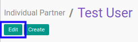

# Memodifikasi Individual Partner

## A. INPUT

*(tidak ada instruksi khusus)*

## B. LANGKAH KERJA

1. Buka menu **Partner -> Partner -> Individual Partner**. Abaikan jika sudah berada pada menu yang dimaksud.
2. Buka data individual partner yang akan dimodifikasi. Abaikan jika data sudah dibuka.
3. Klik tombol **Edit** pada bagian atas-kiri form.

4. Isi dan sesuaikan **[Name](./penjelasan.md#field-name)** jika dibutuhkan. Harus diisi.
5. Pilih dan sesuaikan **[Tags](./penjelasan.md#field-tags)** jika dibutuhkan. Tidak harus diisi.
6. Isi dan sesuaikan **[Address](./penjelasan.md#field-address)** jika dibutuhkan. Tidak harus diisi.
7. Isi dan sesuaikan **[Website](./penjelasan.md#field-website)** jika dibutuhkan. Tidak harus diisi.
8. Pilih dan sesuaikan **[Categorized Job Position](./penjelasan.md#field-category-function)** jika dibutuhkan. Tidak harus diisi.
9. Isi dan sesuaikan **[Job Position](./penjelasan.md#field-function)** jika dibutuhkan. Tidak harus diisi.
10. Pilih dan sesuaikan **[Department](./penjelasan.md#field-department)** jika dibutuhkan. Tidak harus diisi.
11. Isi dan sesuaikan **[Phone](./penjelasan.md#field-phone)** jika dibutuhkan. Tidak harus diisi.
12. Isi dan sesuaikan **[Extension](./penjelasan.md#field-ext)** jika dibutuhkan. Tidak harus diisi.
13. Isi dan sesuaikan **[Mobile](./penjelasan.md#field-mobile)** jika dibutuhkan. Tidak harus diisi.
14. Isi dan sesuaikan **[Fax](./penjelasan.md#field-fax)** jika dibutuhkan. Tidak harus diisi.
15. Isi dan sesuaikan **[Email](./penjelasan.md#field-email)** jika dibutuhkan. Tidak harus diisi.
16. Pilih dan sesuaikan **[Title](./penjelasan.md#field-title)** jika dibutuhkan. Tidak harus diisi.
17. Pilih dan sesuaikan **[Job Level](./penjelasan.md#field-job-level)** jika dibutuhkan. Tidak harus diisi.
18. Pilih dan sesuaikan **[Latest Formal Level Education](./penjelasan.md#field-formal-education-level-id)** jika dibutuhkan. Tidak harus diisi.
19. Pilih dan sesuaikan **[Latest Field of Study](./penjelasan.md#field-field-of-study)** jika dibutuhkan. Tidak harus diisi.
20. Isi dan sesuaikan **[Latest GPA](./penjelasan.md#field-gpa)** jika dibutuhkan. Tidak harus diisi.
21. Isi dan sesuaikan **[Latest Diploma](./penjelasan.md#field-diploma)** jika dibutuhkan. Tidak harus diisi.
22. Pilih dan sesuaikan **[Field of Work](./penjelasan.md#field-field-of-work)** jika dibutuhkan. Tidak harus diisi.
23. Beralih ke tab **[Other Positions](./penjelasan.md#tab-other-positions)**.
24. <a name="l24">[Tambah](./menambah-other-positions.md)/[Modifikasi](./memodifikasi-other-positions.md)/[Hapus](./menghapus-other-positions.md) **Other Positions**</a>. Ulangi langkah ini sampai **Other Positions** sesuai dengan keinginan.
25. Beralih ke tab **[Internal Notes](./penjelasan.md#tab-internal-notes)**.
26. Isi dan sesuaikan **[Internal Notes](./penjelasan.md#field-internal-notes)** jika dibutuhkan. Tidak harus diisi.
27. Beralih ke tab **[Personal Information](./penjelasan.md#tab-personal-information)**.
28. Pilih dan sesuaikan **[Birthdate](./penjelasan.md#field-personal-information-birthdate)** jika dibutuhkan. Tidak harus diisi.
29. Isi dan sesuaikan **[Place of Birth](./penjelasan.md#field-personal-information-birthplace)** jika dibutuhkan. Tidak harus diisi.
30. Isi dan sesuaikan **[Nationality](./penjelasan.md#field-personal-information-nationality)** jika dibutuhkan. Tidak harus diisi.
31. Isi dan sesuaikan **[Gender](./penjelasan.md#field-personal-information-gender)** jika dibutuhkan. Tidak harus diisi.
32. Isi dan sesuaikan **[Ethnicity](./penjelasan.md#field-personal-information-ethnicity)** jika dibutuhkan. Tidak harus diisi.
33. Isi dan sesuaikan **[Blood Type (ABO)](./penjelasan.md#field-personal-information-blood-abo)** jika dibutuhkan. Tidak harus diisi.
34. Isi dan sesuaikan **[Blood Type (Rh)](./penjelasan.md#field-personal-information-blood-rh)** jika dibutuhkan. Tidak harus diisi.
35. Isi dan sesuaikan **[Religion](./penjelasan.md#field-personal-information-religion)** jika dibutuhkan. Tidak harus diisi.
36. Beralih ke tab **[Sales & Purchases](./penjelasan.md#tab-sales-purchases)**.
37. Pilih dan sesuaikan **[Salesperson](./penjelasan.md#field-sale-purchase-user-id)** jika dibutuhkan. Tidak harus diisi.
38. Pilih dan sesuaikan **[Sales Team](./penjelasan.md#field-sale-purchase-sales-team)** jika dibutuhkan. Tidak harus diisi.
39. Pilih dan sesuaikan **[Company](./penjelasan.md#field-sale-purchase-company)** jika dibutuhkan. Tidak harus diisi.
40. Isi dan sesuaikan **[Contact Reference](./penjelasan.md#field-sale-ref)** jika dibutuhkan. Tidak harus diisi.
41. Pilih dan sesuaikan **[Language](./penjelasan.md#field-sale-purchase-language)** jika dibutuhkan. Tidak harus diisi.
42. Pilih dan sesuaikan **[Date](./penjelasan.md#field-sale-purchase-date)** jika dibutuhkan. Tidak harus diisi.
43. Pilih dan sesuaikan **[Receive Inbox Notifications by Email](./penjelasan.md#field-sale-purchase-notify-email)** jika dibutuhkan. Tidak harus diisi.
44. Pilih dan sesuaikan **[Primary Creditor](./penjelasan.md#field-sales-purchases-tabel-cr-primary-creditur)** jika dibutuhkan. Tidak harus diisi.
45. <a name="l45">[Tambah](./menambah-kreditur.md)/[Hapus](./menghapus-creditur.md) **Creditors**</a>. Ulangi langkah ini sampai **Creditors** sesuai dengan keinginan.
46. <a name="l46">[Tambah](./menambah-debitur.md)/[Hapus](./menghapus-debitur.md) **Debitors**</a>. Ulangi langkah ini sampai **Debitors** sesuai dengan keinginan.
47. Pilih dan sesuaikan **[Sales Pricelist](./penjelasan.md#field-sale-purchase-property-product-pricelist)** jika dibutuhkan. Tidak harus diisi.
48. Pilih dan sesuaikan **[Purchase Pricelist](./penjelasan.md#field-sale-purchase-property-product-pricelist-purchase)** jika dibutuhkan. Tidak harus diisi.
49. Pilih dan sesuaikan **[Customer Location](./penjelasan.md#field-sale-purchase-property-stock-customer)** jika dibutuhkan. Tidak harus diisi.
50. Pilih dan sesuaikan **[Supplier Location](./penjelasan.md#field-sale-purchase-property-stock-supplier)** jika dibutuhkan. Tidak harus diisi.
51. Beralih ke tab **[ID Numbers](./penjelasan.md#tab-id-numbers)**.
52. <a name="l52">[Tambah](./menambah-id-numbers.md)/[Modifikasi](./memodifikasi-id-numbers.md)/[Hapus](./menghapus-id-numbers.md) **ID Numbers**</a>. Ulangi langkah ini sampai **ID Numbers** sesuai dengan keinginan.
53. Beralih ke tab **[Accounting](./penjelasan.md#tab-accounting)**.
54. Pilih dan sesuaikan **[Fiscal Position](./penjelasan.md#field-accounting-header-property-account-position)** jika dibutuhkan. Tidak harus diisi.
55. Isi dan sesuaikan **[TIN](./penjelasan.md#field-accounting-header-tin)** jika dibutuhkan. Tidak harus diisi.
56. Pilih dan sesuaikan **[Account Receivable](./penjelasan.md#field-accounting-header-property-account-receivable)** jika dibutuhkan. Tidak harus diisi.
57. Pilih dan sesuaikan **[Customer Payment Term](./penjelasan.md#field-accounting-header-property-payment-term)** jika dibutuhkan. Tidak harus diisi.
58. Isi dan sesuaikan **[Total Receivable](./penjelasan.md#field-accounting-header-credit)** jika dibutuhkan. Tidak harus diisi.
59. Isi dan sesuaikan **[Credit Limit](./penjelasan.md#field-accounting-header-credit-limit)** jika dibutuhkan. Tidak harus diisi.
60. Pilih dan sesuaikan **[Latest Full Reconcilliation Date](./penjelasan.md#field-accounting-header-last-reconcile-date)** jika dibutuhkan. Tidak harus diisi.
61. Pilih dan sesuaikan **[Account Payable](./penjelasan.md#field-accounting-header-property-account-payable)** jika dibutuhkan. Tidak harus diisi.
62. Pilih dan sesuaikan **[Supplier Payment Term](./penjelasan.md#field-accounting-header-property-supplier-payment-term)** jika dibutuhkan. Tidak harus diisi.
63. Isi dan sesuaikan **[Total Payable](./penjelasan.md#field-accounting-header-debit)** jika dibutuhkan. Tidak harus diisi.
64. <a name="l64">[Tambah](./menambah-account-number.md)/[Modifikasi](./memodifikasi-account-number.md)/[Hapus](./menghapus-account-number.md) **Account Number**</a>. Ulangi langkah ini sampai **Account Number** sesuai dengan keinginan.
65. Pilih dan sesuaikan **[PTKP Category](./penjelasan.md#field-accounting-pph21-info-pktp-category)** jika dibutuhkan. Tidak harus diisi.
66. Beralih ke tab **[Family](./penjelasan.md#tab-family)**.
67. Pilih dan sesuaikan **[Father](./penjelasan.md#field-family-father)** jika dibutuhkan. Tidak harus diisi.
68. Pilih dan sesuaikan **[Mother](./penjelasan.md#field-family-mother)** jika dibutuhkan. Tidak harus diisi.
69. Pilih dan sesuaikan **[Guardian](./penjelasan.md#field-family-guardian)** jika dibutuhkan. Tidak harus diisi.
70. Pilih dan sesuaikan **[Spouse](./penjelasan.md#field-family-spouse)** jika dibutuhkan. Tidak harus diisi.
71. Beralih ke tab **[Emergency Contacts](./penjelasan.md#tab-emergency-contacts)**.
72. <a name="l72">[Tambah](./menambah-kontak-darurat.md)/[Hapus](./menghapus-kontak-darurat.md) **Emergency Contacts**</a>. Ulangi langkah ini sampai **Emergency Contacts** sesuai dengan keinginan.
73. Beralih ke tab **[Geo Localization](./penjelasan.md#tab-geo-localization)**.
74. Pilih dan sesuaikan **[Grade](./penjelasan.md#field-geo-localization-grade)** jika dibutuhkan. Tidak harus diisi.
75. Pilih dan sesuaikan **[Activation](./penjelasan.md#field-geo-localization-activation)** jika dibutuhkan. Tidak harus diisi.
76. Pilih dan sesuaikan **[Implemented By](./penjelasan.md#field-geo-localization-implemented-by)** jika dibutuhkan. Tidak harus diisi.
77. Pilih dan sesuaikan **[Grade Weight](./penjelasan.md#field-geo-localization-grade-weight)** jika dibutuhkan. Tidak harus diisi.
78. Pilih dan sesuaikan **[Latest Partner Review](./penjelasan.md#field-geo-localization-latest-partner-review)** jika dibutuhkan. Tidak harus diisi.
79. Pilih dan sesuaikan **[Next Partner Review](./penjelasan.md#field-geo-localization-next-partner-review)** jika dibutuhkan. Tidak harus diisi.
80. Pilih dan sesuaikan **[Partnership Date](./penjelasan.md#field-geo-localization-partnership-date)** jika dibutuhkan. Tidak harus diisi.
81. Isi dan sesuaikan **[Geo Latitude](./penjelasan.md#field-geo-localization-latitude)** jika dibutuhkan. Tidak harus diisi.
82. Isi dan sesuaikan **[Geo Longitude](./penjelasan.md#field-geo-localization-longitude)** jika dibutuhkan. Tidak harus diisi.
83. Isi dan sesuaikan **[Geo Localization Date](./penjelasan.md#field-geo-localization-localization-date)** jika dibutuhkan. Tidak harus diisi.
84. Klik tombol **Save** pada bagian atas-kiri form

## C. OUTPUT

* Data individual partner akan berubah sesuai dengan perubahan yang dilakukan
