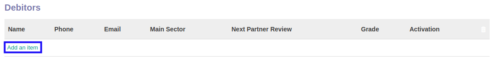
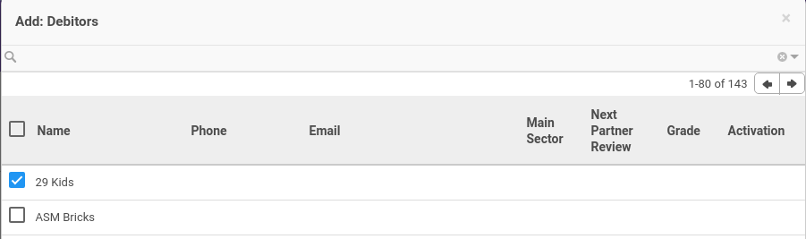
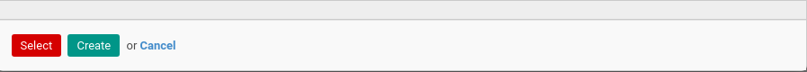
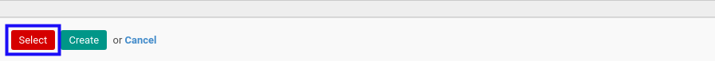

# Menambahkan Debitor

*(Instruksi kerja ini merupakan sub instruksi dari (1) [Membuat Individual Partner](./membuat.md), atau (2) [Memodifikasi Individual Partner](./memodifikasi.md). Instruksi kerja ini tidak bisa berdiri sendiri)*

## A. INPUT

*(Tidak ada instruksi khusus)*

## B. LANGKAH KERJA

1. Klik label **Add an Item** pada bagian atas-kiri tabel ***Debitors***

Pop-up ***Debitors*** akan muncul.

2. Seleksi data *Debitors*.
3. Klik tombol **Select** pada bagian bawah-kiri pop-up ***Debitors***

4. Lanjutkan [langkah ke-45 instruksi kerja Membuat Individual Partner](./membuat.md#l45) atau [langkah ke-46 instruksi kerja Memodifikasi Individual Partner](./memodifikasi.md#l46).

## C. OUTPUT

*(Tidak ada instruksi khusus)*
