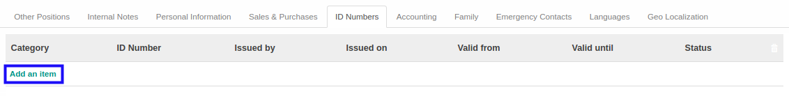
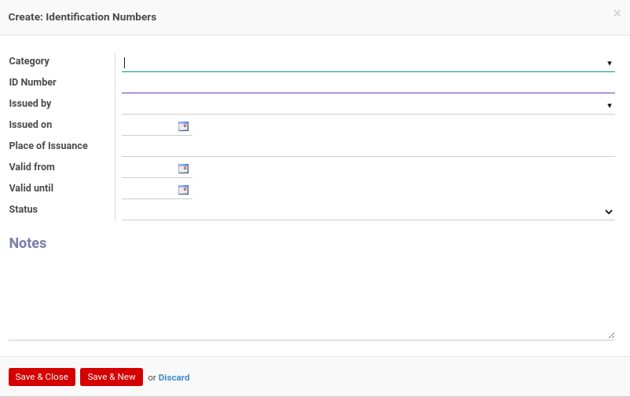

# Menambahkan ID Number

*(Instruksi kerja ini merupakan sub instruksi dari (1) [Membuat Individual Partner](./membuat.md), atau (2) [Memodifikasi Individual Partner](./memodifikasi.md). Instruksi kerja ini tidak bisa berdiri sendiri)*

## A. INPUT

*(Tidak ada instruksi khusus)*

## B. LANGKAH KERJA

1. Klik label **Add an Item** pada bagian atas-kiri tabel ***ID Numbers***

Pop-up ***ID Numbers*** akan muncul.

2. Pilih **[Category](./penjelasan.md#field-id-number-category-id)**. Harus diisi.
3. Isi **[ID Number](./penjelasan.md#field-id-number-name)**. Harus diisi.
4. Pilih **[Issued By](./penjelasan.md#field-id-number-partner-issued-id)**. Tidak harus diisi.
5. Pilih **[Issued On](./penjelasan.md#field-id-number-partner-date-issued)**. Tidak harus diisi.
6. Isi **[Place of Issuance](./penjelasan.md#field-id-number-place-issuance)**. Tidak harus diisi.
7. Pilih **[Valid From](./penjelasan.md#field-id-number-valid-from)**. Tidak harus diisi.
8. Pilih **[Vaid Until](./penjelasan.md#field-id-number-valid-until)**. Tidak harus diisi.
9. Pilih **[Status](./penjelasan.md#field-id-number-status)**. Tidak harus diisi.
10. Isi **[Notes](./penjelasan.md#field-id-number-notes)**. Tidak harus diisi.
11. Klik tombol **Save & Close** pada bagian bawah-kiri pop-up **ID Numbers** untuk menyimpan data. Klik tombol **Save & New** pada bagian bawah-kiri pop-up **ID Numbers** untuk menyimpan data dan menambahkan data baru.

12. Ulangi langkah ke-2 jika pada langkah ke-11 tombol **Save & New** yang dipilih.
13. Lanjutkan [langkah ke-51 instruksi kerja Membuat Individual Partner](./membuat.md#l51) atau [langkah ke-52 instruksi kerja Memodifikasi Individual Partner](./memodifikasi.md#l52).

## C. OUTPUT

*(Tidak ada instruksi khusus)*
