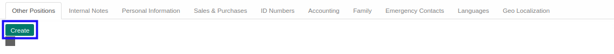
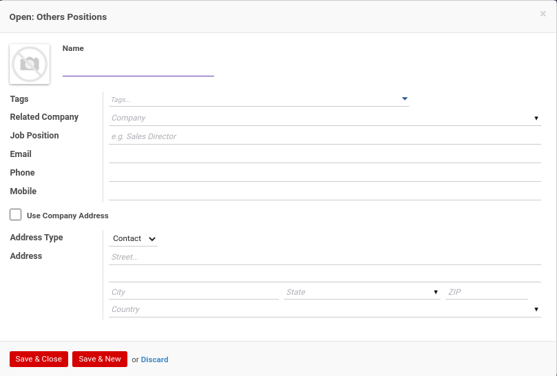

# Menambahkan Other Positions

*(Instruksi kerja ini merupakan sub instruksi dari (1) [Membuat Individual Partner](./membuat.md), atau (2) [Memodifikasi Individual Partner](./memodifikasi.md). Instruksi kerja ini tidak bisa berdiri sendiri)*

## A. INPUT

*(Tidak ada instruksi khusus)*

## B. LANGKAH KERJA

1. Klik tombol **Create** pada bagian atas-kiri tab ***Other Positions***

Pop-up ***Other Positions*** akan muncul.

2. Isi **[Name](./penjelasan.md#field-other-positions-name)**. Harus diisi.
3. Pilih **[Tags](./penjelasan.md#field-other-positions-tags)**. Tidak harus diisi.
4. Pilih **[Related Company](./penjelasan.md#field-other-positions-company-id)**. Tidak harus diisi.
5. Isi **[Job Position](./penjelasan.md#field-other-positions-job-position)**. Tidak harus diisi.
6. Isi **[Email](./penjelasan.md#field-other-positions-job-email)**. Tidak harus diisi.
7. Isi **[Phone](./penjelasan.md#field-other-positions-job-phone)**. Tidak harus diisi.
8. Isi **[Mobile](./penjelasan.md#field-other-positions-job-mobile)**. Tidak harus diisi.
9. Pilih **[Address Type](./penjelasan.md#field-other-positions-job-address-type)**. Tidak harus diisi.
10. Isi **[Address](./penjelasan.md#field-other-positions-address)**. Tidak harus diisi.
11. Klik tombol **Save & Close** pada bagian bawah-kiri pop-up **Other Positions** untuk menyimpan data. Klik tombol **Save & New** pada bagian bawah-kiri pop-up **Other Positions** untuk menyimpan data dan menambahkan data baru.

12. Ulangi langkah ke-2 jika pada langkah ke-11 tombol **Save & New** yang dipilih.
13. Lanjutkan [langkah ke-23 instruksi kerja Membuat Individual Partner](./membuat.md#l23) atau [langkah ke-24 instruksi kerja Memodifikasi Individual Partner](./memodifikasi.md#l24).

## C. OUTPUT

*(Tidak ada instruksi khusus)*
