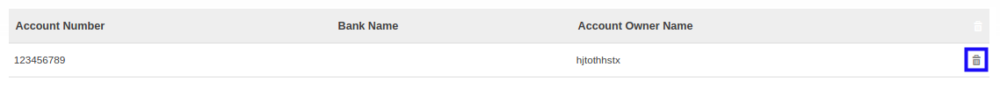

# Menghapus Account Number

*(Instruksi kerja ini merupakan sub instruksi dari (1) [Membuat Individual Partner](./membuat.md), atau (2) [Memodifikasi Individual Partner](./memodifikasi.md). Instruksi kerja ini tidak bisa berdiri sendiri)*

## A. INPUT

*(Tidak ada instruksi khusus)*

## B. LANGKAH KERJA

1. Klik icon tempat sampah pada bagian kanan data **Account Number** yang akan dihapus.

2. Lanjutkan [langkah ke-63 instruksi kerja Membuat Individual Partner](./membuat.md#l63) atau [langkah ke-64 instruksi kerja Memodifikasi Individual Partner](./memodifikasi.md#l64).

## C. OUTPUT

*(Tidak ada instruksi khusus)*
