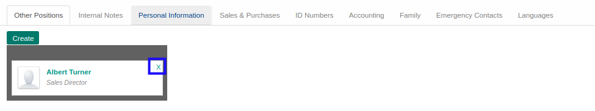

# Menghapus Other Positions

*(Instruksi kerja ini merupakan sub instruksi dari (1) [Membuat Individual Partner](./membuat.md), atau (2) [Memodifikasi Individual Partner](./memodifikasi.md). Instruksi kerja ini tidak bisa berdiri sendiri)*

## A. INPUT

*(Tidak ada instruksi khusus)*

## B. INSTRUKSI KERJA

1. Klik icon x pada bagian pojok atas-kanan kotak yang berisi nama *Other Positions*

2. Ulangi langkah ke-1 untuk setiap *Other Positions* yang akan dihapus.
3. Lanjutkan [langkah ke-23 instruksi kerja Membuat Individual Partner](./membuat.md#l23) atau [langkah ke-24 instruksi kerja Memodifikasi Individual Partner](./memodifikasi.md#l24).

## C. OUTPUT

*(Tidak ada instruksi khusus)*
