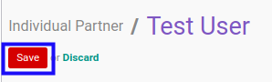

# Menonaktifkan Individual Partner

## A. INPUT

* Data *Individual Partner* yang akan dinonaktifkan harus memiliki status **Active**

## B. LANGKAH KERJA

1. Buka menu **Partner -> Partner -> Individual Partner**. Abaikan jika sudah berada pada menu yang dimaksud.
2. Buka data *Individual Partner* yang akan dinonaktifkan. Abaikan jika data sudah dibuka.
3. Klik tombol **Edit** pada bagian atas-kiri form.

4. Beralih ke tab **[Sales & Purchases](./penjelasan.md#tab-sales-purchases)**.
5. Deaktifkan **[Active](./penjelasan.md#field-sale-purchase-active)**.
6. Klik tombol **Save** pada bagian atas-kiri form.

## C. OUTPUT

* Data *Individual Partner* akan non aktif.
