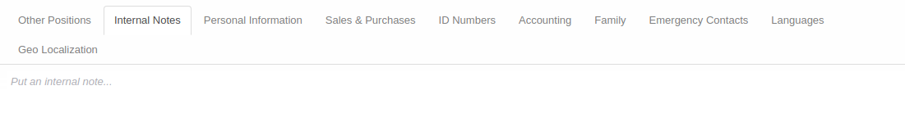
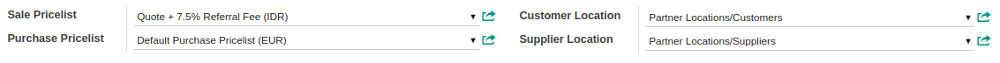

# Penjelasan

Informasi pada Individual Partner dibagi menjadi beberapa area, diantaranya:

* [Header](#bagian-header)
* [Tab Other Positions](#tab-other-positions)
* [Tab Internal Notes](#tab-internal-notes)
* [Tab Personal Information](#tab-personal-information)
* [Tab Sales & Purchases](#tab-sales-purchases)
* [Tab ID Numbers](#tab-id-numbers)
* [Tab Accounting](#tab-accounting)
* [Tab Family](#tab-family)
* [Tab Emergency Contacts](#tab-emergency-contacts)
* [Tab Languages](#tab-languages)
* [Tab Geo Localization](#tab-geo-localization)

### <a name="bagian-header">HEADER</a>

#### <a name="field-image">Image</a>

 

Foto *Partner*

#### <a name="field-name">Name</a>

Nama *Partner*

#### <a name="field-tags">Tags</a>

*Tags Partner*

#### <a name="field-smart-button">Smart Button</a>

 

Tombol-tombol yang berfungsi sebagai *Shortcut* untuk masuk ke dalam menu yang berkaitan dan juga sebagai pemberi informasi mengenai seberapa banyak data, total, dll  

#### <a name="field-address">Address</a>

Alamat partner. Terbagi atas beberapa isian, yaitu: 
* **Street:** Alamat *Partner*
* **Number:** Nomor jalan *Partner*
* **City completion:** Informasi kota secara lengkap
* **City:** Kota dimana *Partner* berada
* **State:** Provinsi dimana *Partner* berada
* **Zip:** Nomor kode POS *Partner*
* **Country:** Negara dimana *Partner* berada

#### <a name="field-website">Website</a>

Alamat website *Partner*

#### <a name="field-category-function">Categorized Job Position</a>

Kategori jabatan *Partner*

#### <a name="field-function">Job Position</a>

Jabatan *Partner*

#### <a name="field-department">Department</a>

Departement *Partner*

#### <a name="field-phone">Phone</a>

Nomor telepon *Partner*

#### <a name="field-ext">Extension</a>

Nomor telepon extension *Partner*

#### <a name="field-mobile">Mobile</a>

Nomor handphone/mobile *Partner*

#### <a name="field-fax">Fax</a>

Nomor fax *Partner*

#### <a name="field-email">Email</a>

Alamat email *Partner*

#### <a name="field-title">Title</a>

Bentuk usaha *Partner*

#### <a name="field-job-level">Job Level</a>

Job level *Partner*

#### <a name="field-formal-education-level-id">Latest Formal Level Education</a>

Pendidikan terakhir *Partner*

#### <a name="field-field-of-study">Latest Field of Study</a>

Bidang studi terakhir *Partner*

#### <a name="field-gpa">GPA</a>

Nilai IPK terakhir *Partner*

#### <a name="field-diploma">Latest Diploma</a>

Diploma terakhir *Partner*

#### <a name="field-field-of-work">Field of Work</a>

Bidang pekerjaan *Partner*

### <a name="tab-other-positions">TAB OTHER POSITIONS</a>

#### <a name="field-other-positions-image">Image</a>

 

Foto kontak

#### <a name="field-other-positions-name">Name</a>

Nama kontak

#### <a name="field-other-positions-tags">Tags</a>

*Tags* kontak

#### <a name="field-other-positions-company-id">Related Company</a>

Relasi company kontak

#### <a name="field-other-positions-job-position">Job Position</a>

Posisi/jabatan kontak

#### <a name="field-other-positions-job-email">Email</a>

Alamat email kontak

#### <a name="field-other-positions-job-phone">Phone</a>

Nomor telepon kontak

#### <a name="field-other-positions-job-mobile">Mobile</a>

Nomor handphone/mobile kontak

#### <a name="field-other-positions-company-address">Use Company Address</a>

Jika dipilih, maka alamat kontak akan menggunakan alamat perusahaan.

#### <a name="field-other-positions-job-address-type">Address Type</a>

Tipe alamat. Terbagi atas 5 tipe, yaitu: 
* **Default:** Todo
* **Invoice:** Todo
* **Shipping:** Todo
* **Contact:** Todo
* **Other:** Todo

#### <a name="field-other-positions-address">Address</a>

Alamat kontak.

### <a name="tab-internal-notes">TAB INTERNAL NOTES</a>

#### <a name="field-internal-notes">Internal Notes</a>

Catatan internal terkait *Partner*

### <a name="tab-personal-information">TAB PERSONAL INFORMATION</a>

#### <a name="field-personal-information-birthdate">Birthdate</a>

Tanggal lahir *Partner*

#### <a name="field-personal-information-birthplace">Place of Birth</a>

Tempat lahir *Partner*

#### <a name="field-personal-information-nationality">Nationality</a>

Kebangsaan *Partner*

#### <a name="field-personal-information-gender">Gender</a>

Jenis Kelamin *Partner*

#### <a name="field-personal-information-blood-abo">Blood Type (ABO)</a>

Golongan darah *Partner*

#### <a name="field-personal-information-blood-rh">Blood Type (Rh)</a>

Rhesus darah *Partner*

#### <a name="field-personal-information-religion">Religion</a>

Agama *Partner*

#### <a name="field-personal-information-ethnicity">Ethnicity</a>

Etnis *Partner*

### <a name="tab-sales-purchases">TAB SALES & PURCHASES</a>

#### <a name="field-sale-purchase-user-id">Salesperson</a>

Nama *Salesperson*

#### <a name="field-sale-purchase-sales-team">Sales Team</a>

Nama sales team.

#### <a name="field-sale-purchase-company">Company</a>

Nama perusahaan.

#### <a name="field-sale-purchase-ref">Contact Reference</a>

Referensi *Partner*

#### <a name="field-sale-purchase-language">Languange</a>

Bahasa yang digunakan

#### <a name="field-sale-purchase-date">Date</a>

Tanggal

#### <a name="field-sale-purchase-customer">Customer</a>

Jika dipilih, maka *Partner* akan ditandai sebagai *Customer*(Pelanggan)

#### <a name="field-sale-purchase-supplier">Supplier</a>

Jika dipilih, maka *Partner* akan ditandai sebagai *Supplier*(Pemasok)

#### <a name="field-sale-purchase-active">Active</a>

Sebagai penanda apakah data adalah aktif/non-aktif

#### <a name="field-sale-purchase-publish">Publish</a>

Jika dipilih, maka *Partner* akan ter-*publish* pada website

#### <a name="field-sale-purchase-opt-out">Opt-Out</a>

Jika dipilih, maka *Partner* tidak akan menerima email untuk *Mass Mailing* dan *Marketing Campaign*

#### <a name="field-sale-purchase-notify-email">Receive Inbox Notifications by Email</a>

Terbagi atas 2 pilihan, yaitu: 
* **Never:** Jika dipilih, *Partner* tidak akan menerima notifikasi email
* **All Messages:** Jika dipilih, *Partner* akan menerima notifikasi email

### <a name="tab-sales-purchases-tabel-cr">TABEL CREDITORS</a>

#### <a name="field-sales-purchases-tabel-cr-primary-creditur">Primary Creditur</a>

Nama kreditur utama

### <a name="tab-sales-purchases-tabel-cr-detail">DETAIL CREDITORS</a>

#### <a name="field-sales-purchases-tabel-cr-name">Name</a>

Nama kreditur

#### <a name="field-sales-purchases-tabel-cr-phone">Phone</a>

Nomor telepon kreditur

#### <a name="field-sales-purchases-tabel-cr-email">Email</a>

Alamat email kreditur

#### <a name="field-sales-purchases-tabel-cr-main-sector">Main Sector</a>

Sektor utama kreditur

#### <a name="field-sales-purchases-tabel-cr-partner-review">Next Partner Review</a>

Todo

#### <a name="field-sales-purchases-tabel-cr-grade">Grade</a>

Todo

#### <a name="field-sales-purchases-tabel-cr-activation">Activation</a>

Todo

### <a name="tab-sales-purchases-tabel-db">TABEL DEBITORS</a>

### <a name="tab-sales-purchases-tabel-db-detail">DETAIL DEBITORS</a>

#### <a name="field-sales-purchases-tabel-db-name">Name</a>

Nama debitur

#### <a name="field-sales-purchases-tabel-db-phone">Phone</a>

Nomor telepon debitur

#### <a name="field-sales-purchases-tabel-db-email">Email</a>

Alamat email debitur

#### <a name="field-sales-purchases-tabel-db-main-sector">Main Sector</a>

Sektor utama debitur

#### <a name="field-sales-purchases-tabel-db-partner-review">Next Partner Review</a>

Todo

#### <a name="field-sales-purchases-tabel-db-grade">Grade</a>

Todo

#### <a name="field-sales-purchases-tabel-db-activation">Activation</a>

Todo

### <a name="tab-sales-purchases-pricelist">OTHER</a>

#### <a name="field-sale-purchase-property-product-pricelist">Sale Pricelist</a>

Daftar harga penjualan

#### <a name="field-sale-purchase-property-product-pricelist-purchase">Purchase Pricelist</a>

Daftar harga pembelian

#### <a name="field-sale-purchase-property-stock-customer">Customer Location</a>

Lokasi *Customer*(Pelanggan)

#### <a name="field-sale-purchase-property-stock-supplier">Supplier Location</a>

Lokasi *Supplier*(Pemasok)

### <a name="tab-id-numbers">TAB ID NUMBERS</a>

#### <a name="field-id-number-category-id">Category</a>

Kategori dari nomor identitas yang akan digunakan 
*Ex:* SIM, KTP

#### <a name="field-id-number-name">ID Number</a>

Nomor identitas

#### <a name="field-id-number-partner-issued-id">Issued By</a>

Informasi yang mengeluarkan nomor identitas

#### <a name="field-id-number-partner-date-issued">Issued On</a>

Tanggal identitas dikeluarkan

#### <a name="field-id-number-place-issuance">Place of Issuance</a>

Tempat diterbitkannya nomor identitas

#### <a name="field-id-number-valid-from">Valid From</a>

Tanggal mulai validnya nomor identitas

#### <a name="field-id-number-valid-until">Valid Until</a>

Tanggal akhir validnya nomor identitas

#### <a name="field-id-number-status">Status</a>

Status identitas. Terbagi atas 4 pilihan, yaitu: 
* **New:** Identitas baru
* **Running:** Identitas yang sedang berjalan
* **To Renew:** Identitas perlu diperpanjang
* **Expired:** Identitas sudah tidak aktif

#### <a name="field-id-number-notes">Notes</a>

Catatan tambahan terkait nomor identitas

### <a name="tab-accounting">TAB ACCOUNTING</a>

### <a name="tab-accounting-header">HEADER</a>

#### <a name="field-accounting-header-property-account-position">Fiscal Position</a>

Terbagi atas 2 pilihan, yaitu: 
* **Normal Taxes:** Todo
* **Tax Exempt:** Todo

#### <a name="field-accounting-header-tin">TIN</a>

Pengecekan terkait nomor identifikasi pajak.

> **Catatan:** TIN(Inggris: *Tax Identification Number* disingkat TIN)

#### <a name="field-accounting-header-property-account-receivable">Account Receivable</a>

Akun piutang dagang

#### <a name="field-accounting-header-property-payment-term">Customer Payment Term</a>

Jangka waktu pembayaran *Customer*(Pelanggan)

#### <a name="field-accounting-header-credit">Total Receivable</a>

Informasi terkait total piutang

#### <a name="field-accounting-header-credit-limit">Credit Limit</a>

Informasi batas kredit

#### <a name="field-accounting-header-last-reconcile-date">Latest Full Reconciliation Date</a>

Todo

#### <a name="field-accounting-header-property-account-payable">Account Payable</a>

Akun piutang hutang

#### <a name="field-accounting-header-property-supplier-payment-term">Supplier Payment Term</a>

Jangka waktu pembayaran *Supplier*(Pemasok)

#### <a name="field-accounting-header-debit">Total Payable</a>

Informasi terkait total yang harus dibayar

### <a name="tab-accounting-detail-bank">DETAIL BANK</a>

#### <a name="field-accounting-detail-bank-state">Bank Account Type</a>

Tipe akun bank

#### <a name="field-accounting-detail-bank-acc-number">Account Number</a>

Nomor akun bank

#### <a name="field-accounting-detail-bank-active">Active</a>

Sebagai penanda apakah data adalah aktif/non-aktif

#### <a name="field-accounting-detail-bank-partner-id">Account Owner</a>

Pemilik akun bank

#### <a name="field-accounting-detail-bank-address">Address</a>

Alamat Bank. Terbagi atas beberapa isian, yaitu: 
* Name - Nama pemilik akun bank
* Street - Alamat akun bank
* Zip - Nomor kode POS akun bank
* City - Kota akun bank
* State - Provinsi akun bank
* Country - Negara akun bank

#### <a name="field-accounting-detail-bank-bank">Bank</a>

Bank yang akan digunakan

#### <a name="field-accounting-detail-bank-bank_name">Bank Name</a>

Nama bank

#### <a name="field-accounting-detail-bank-bic">Bank Identifier Code</a>

Kode bank

### <a name="tab-accounting-pph21-info">PPH21 Information</a>

#### <a name="field-accounting-pph21-info-pktp-category">PKTP Category</a>

Kategori PTKP(Penghasilan Tidak Kena Pajak)

### <a name="tab-family">TAB FAMILY</a>

#### <a name="field-family-father">Father</a>

Nama ayah *Partner*

#### <a name="field-family-mother">Mother</a>

Nama ibu *Partner*

#### <a name="field-family-guardian">Guardian</a>

Nama wali *Partner*

#### <a name="field-family-spouse">Spouse</a>

Nama pasangan *Partner*

### <a name="tab-emergency-contacts">TAB EMERGENCY CONTACTS</a>

#### <a name="field-emergency-contacts-name">Name</a>

Nama kontak darurat

#### <a name="field-emergency-contacts-phone">Phone</a>

Nomor telepon kontak darurat

#### <a name="field-emergency-contacts-email">Email</a>

Alamat email kontak darurat

#### <a name="field-emergency-contacts-sector">Main Sector</a>

Sektor utama kontak darurat

#### <a name="field-emergency-contacts-review">Next Partner Review</a>

Todo

#### <a name="field-emergency-contacts-grade">Grade</a>

Todo

#### <a name="field-emergency-contacts-activation">Activation</a>

Todo

### <a name="tab-languages">TAB LANGUAGES</a>

#### <a name="field-languages-language">Language</a>

Nama bahasa

#### <a name="field-languages-reading">Reading</a>

Kemampuan membaca

#### <a name="field-languages-writing">Writing</a>

Kemampuan menulis

#### <a name="field-languages-speaking">Speaking</a>

Kemampuan bicara

#### <a name="field-languages-listening">Listening</a>

Kemampuan mendengar

### <a name="tab-geo-localization">TAB GEO LOCALIZATION</a>

#### <a name="field-geo-localization-grade">Grade</a>

Todo

#### <a name="field-geo-localization-activation">Activation</a>

Todo

#### <a name="field-geo-localization-implemented-by">Implemented By</a>

Todo

#### <a name="field-geo-localization-grade-weight">Grade Weight</a>

Todo

#### <a name="field-geo-localization-latest-partner-review">Latest Partner Review</a>

Todo

#### <a name="field-geo-localization-next-partner-review">Next Partner Review</a>

Todo

#### <a name="field-geo-localization-partnership-date">Partnership Date</a>

Todo

#### <a name="field-geo-localization-latitude">Geo Latitude</a>

Posisi latitude Lokasi

#### <a name="field-geo-localization-longitude">Geo Longitude</a>

Posisi longitude Lokasi

#### <a name="field-geo-localization-localization-date">Geo Localization Date</a>

Tanggal Geo Localization
