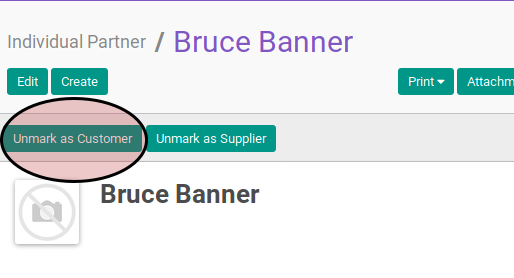

# Menandai Sebagai Bukan Konsumen

## A. INPUT

* Data individual partner yang akan ditandai sebagai konsumen harus memiliki nilai **Customer** True/Aktif/Check.

## B. LANGKAH KERJA

1. Buka menu **Partner -> Partner -> Individual Partner**. Abaikan jika sudah berada pada menu yang dimaksud.
2. Buka data individual partner yang tidak ingin dijadikan sebagai konsumen. Abaikan jika data sudah dibuka.
3. Klik tombol **Unmark as Customer** pada bagian atas-kiri form.

## C. OUTPUT

* Nilai **Customer** akan berubah menjadi False/Tidak Aktif/Tidak dicheck.
* Data individual partner tidak akan dapat dipilih pada fitur sales order, customer invoice, atau credit note.
