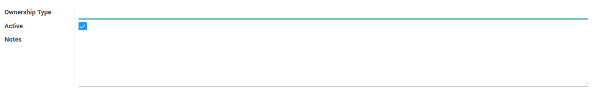

# Kepemilikan

### <a name="bagian-header">HEADER</a>

#### <a name="field-name">Ownership Type</a>

Nama tipe kepemilikan

#### <a name="field-active">Active</a>

Sebagai penanda apakah data adalah aktif/non-aktif

#### <a name="field-notes">Notes</a>

Catatan
