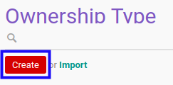
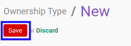

# Membuat Data Kepemilikan

## A. INPUT

*(Tidak ada instruksi khusus)*

## B. LANGKAH KERJA

1. Buka menu **Partner -> Configuration -> Address Book -> Ownership Type**. Abaikan jika sudah berada pada menu yang dimaksud.
2. Klik tombol **Create** pada bagian atas-kiri form.

3. Isi **[Ownership Type](./penjelasan.md#field-name)**. Harus diisi.
4. Aktifkan/ Deaktifkan **[Active](./penjelasan.md#field-active)**. Tidak harus diisi.
5. Isi **[Notes](./penjelasan.md#field-notes)**. Tidak harus diisi.
6. Klik tombol **Save** pada bagian atas-kiri form.

## C. OUTPUT

* Data kepemilikan akan terbuat.
