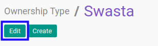
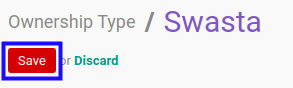

# Memodifikasi Kepemilikan

## A. INPUT

*(Tidak ada instruksi khusus)*

## B. LANGKAH KERJA

1. Buka menu **Partner -> Configuration -> Address Book -> Ownership Type**. Abaikan jika sudah berada pada menu yang dimaksud.
2. Buka data kepemilikan yang akan dimodifikasi. Abaikan jika data sudah dibuka.
3. Klik tombol **Edit** pada bagian atas-kiri form.

4. Isi dan sesuaikan **[Ownership Type](./penjelasan.md#field-name)** jika dibutuhkan. Harus diisi.
5. Aktifkan/ Deaktifkan **[Active](./penjelasan.md#field-active)** jika dibutuhkan. Tidak harus diisi.
6. Isi dan sesuaikan **[Notes](./penjelasan.md#field-notes)** jika dibutuhkan. Tidak harus diisi.
7. Klik tombol **Save** pada bagian atas-kiri form.

## C. OUTPUT

* Data kepemilikan akan berubah sesuai dengan perubahan yang dilakukan.
