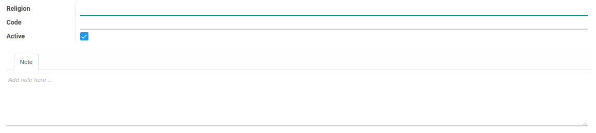

# Agama

### <a name="bagian-header">HEADER</a>

#### <a name="field-name">Religion</a>

Nama agama

#### <a name="field-code">Code</a>

Kode agama

#### <a name="field-active">Active</a>

Sebagai penanda apakah data adalah aktif/non-aktif

#### <a name="field-note">Note</a>

Catatan
