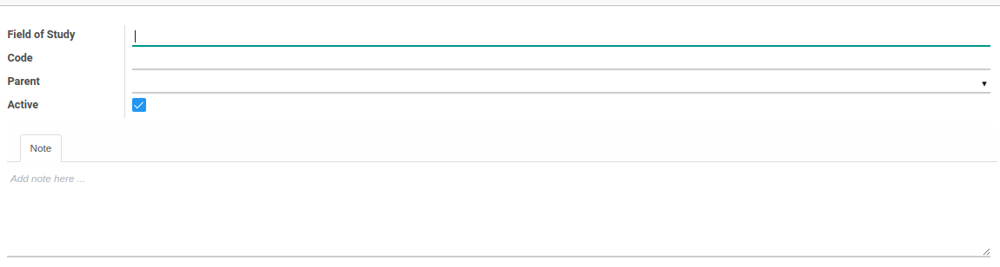

# Bidang Studi

### <a name="bagian-header">HEADER</a>

#### <a name="field-name">Field of Study</a>

Nama bidang studi

#### <a name="field-code">Code</a>

Kode bidang studi

#### <a name="field-parent-id">Parent</a>

Parent/Induk bidang studi

#### <a name="field-active">Active</a>

Sebagai penanda apakah data adalah aktif/non-aktif

#### <a name="field-notes">Note</a>

Catatan
