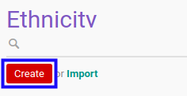

# Membuat Data Etnis

## A. INPUT

*(Tidak ada instruksi khusus)*

## B. LANGKAH KERJA

1. Buka menu **Partner -> Configuration -> Categories & Attributes -> Ethnicities**. Abaikan jika sudah berada pada menu yang dimaksud.
2. Klik tombol **Create** pada bagian atas-kiri form.

3. Isi **[Ethnicity](./penjelasan.md#field-name)**. Harus diisi.
4. Isi **[Code](./penjelasan.md#field-code)**. Tidak harus diisi.
5. Aktifkan/ Deaktifkan **[Active](./penjelasan.md#field-active)**. Tidak harus diisi.
6. Beralih ke tab **[Note](./penjelasan.md#tab-note)**.
7. Isi **[Note](./penjelasan.md#field-note)**. Tidak harus diisi.
8. Klik tombol **Save** pada bagian atas-kiri form.

## C. OUTPUT

* Data etnis akan terbuat.
