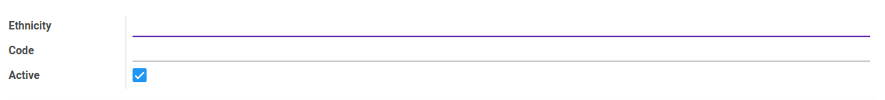
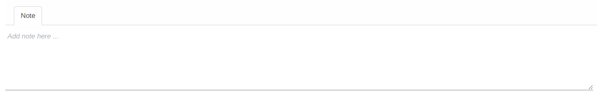

# Etnis

Informasi pada *Etnis* dibagi menjadi beberapa bagian, yaitu:

  * [Header](#bagian-header)
  * [Tab Note](#tab-note)

### <a name="bagian-header">HEADER</a>

#### <a name="field-name">Ethnicity</a>

Nama etnis

#### <a name="field-code">Code</a>

Kode etnis

#### <a name="field-active">Active</a>

Sebagai penanda apakah data adalah aktif/non-aktif

### <a name="tab-note">NOTE</a>

#### <a name="field-note">Note</a>

Catatan
