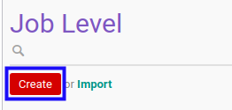

# Membuat Data Jenjang Karir

## A. INPUT

*(Tidak ada instruksi khusus)*

## B. LANGKAH KERJA

1. Buka menu **Partner -> Configuration -> Categories & Attributes -> Job Level**. Abaikan jika sudah berada pada menu yang dimaksud.
2. Klik tombol **Create** pada bagian atas-kiri form.

3. Isi **[Job Level](./penjelasan.md#field-name)**. Harus diisi.
4. Isi **[Code](./penjelasan.md#field-code)**. Tidak harus diisi.
5. Isi **[Sequence](./penjelasan.md#field-sequence-id)**. Harus diisi.
6. Aktifkan/ Deaktifkan **[Active](./penjelasan.md#field-active)**. Tidak harus diisi.
7. Beralih ke tab **[Note](./penjelasan.md#tab-note)**.
8. Isi **[Note](./penjelasan.md#field-note)**. Tidak harus diisi.
9. Klik tombol **Save** pada bagian atas-kiri form.

## C. OUTPUT

* Data jenjang karir akan terbuat.
