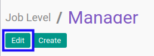

# Memodifikasi Jenjang Karir

## A. INPUT

* User yang akan memodifikasi harus memiliki akses untuk memodifikasi *Jenjang Karir*.

## B. LANGKAH KERJA

1. Buka menu **Partner -> Configuration -> Categories & Attributes -> Job Level**. Abaikan jika sudah berada pada menu yang dimaksud.
2. Buka data *Jenjang Karir* yang akan dimodifikasi. Abaikan jika data sudah dibuka.
3. Klik tombol **Edit** pada bagian atas-kiri form.

4. Isi dan sesuaikan **[Job Level](./penjelasan.md#field-name)** jika dibutuhkan. Harus diisi.
5. Isi dan sesuaikan **[Code](./penjelasan.md#field-code)** jika dibutuhkan. Tidak harus diisi.
6. Isi dan sesuaikan **[Sequence](./penjelasan.md#field-sequence-id)** jika dibutuhkan. Harus diisi.
7. Beralih ke tab **[Note](./penjelasan.md#tab-note)**.
8. Isi dan sesuaikan **[Note](./penjelasan.md#field-note)** jika dibutuhkan. Tidak harus diisi.
9. Klik tombol **Save** pada bagian atas-kiri form.

## C. OUTPUT

* Data *Jenjang Karir* akan berubah sesuai dengan perubahan yang dilakukan.
