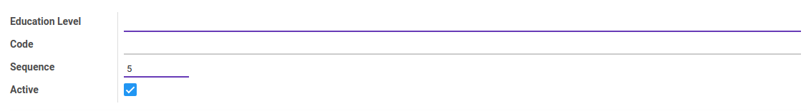
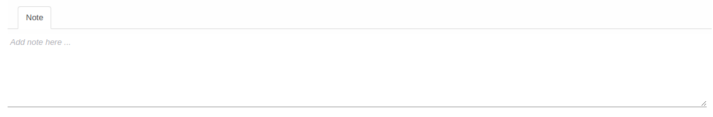

# Jenjang Pendidikan

Informasi pada *Jenjang Pendidikan* dibagi menjadi beberapa bagian, yaitu:

  * [Header](#bagian-header)
  * [Tab Note](#tab-note)

### <a name="bagian-header">HEADER</a>

#### <a name="field-name">Education Level</a>

Nama jenjang pendidikan

#### <a name="field-code">Code</a>

Kode jenjang pendidikan

#### <a name="field-sequence-id">Sequence</a>

Nomor urut

#### <a name="field-active">Active</a>

Sebagai penanda apakah data adalah aktif/non-aktif

### <a name="tab-note">NOTE</a>

#### <a name="field-note">Note</a>

Catatan
