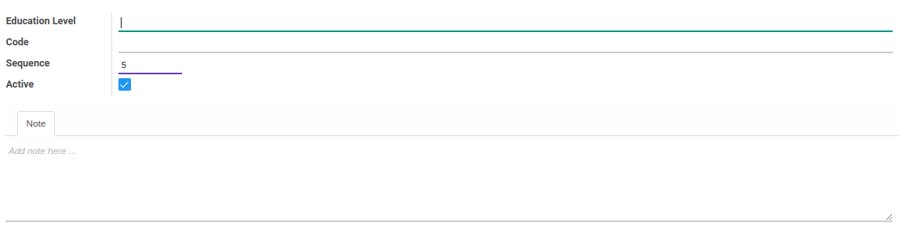

# Jenjang Pendidikan

### <a name="bagian-header">HEADER</a>

#### <a name="field-name">Education Level</a>

Nama jenjang pendidikan

#### <a name="field-code">Code</a>

Kode jenjang pendidikan

#### <a name="field-sequence-id">Sequence</a>

Nomor urut

#### <a name="field-active">Active</a>

Sebagai penanda apakah data adalah aktif/non-aktif

#### <a name="field-notes">Note</a>

Catatan
