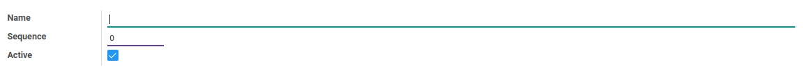

# Titel Akademik

### <a name="bagian-header">HEADER</a>

#### <a name="field-name">Name</a>

Nama titel akademik

#### <a name="field-sequence-id">Sequence</a>

Nomor urut

#### <a name="field-active">Active</a>

Sebagai penanda apakah data adalah aktif/non-aktif
