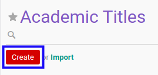

# Membuat Data Titel Akademik

## A. INPUT

*(Tidak ada instruksi khusus)*

## B. LANGKAH KERJA

1. Buka menu **Partner -> Configuration -> Address Book -> Academic Titles**. Abaikan jika sudah berada pada menu yang dimaksud.
2. Klik tombol **Create** pada bagian atas-kiri form.

3. Isi **[Sequence](./penjelasan.md#field-sequence-id)**. Harus diisi.
4. Isi **[Name](./penjelasan.md#field-name)**. Harus diisi.
5. Klik tombol **Save** pada bagian atas-kiri form.

## C. OUTPUT

* Data titel akademik akan terbuat.
