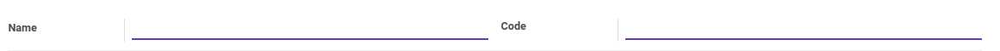
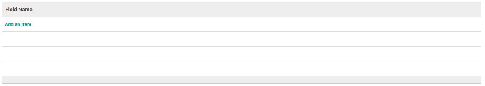
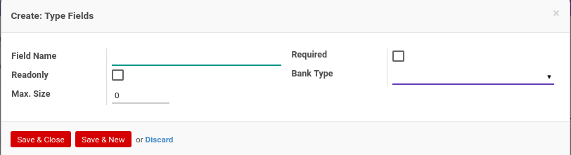
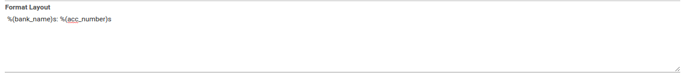

# Bank Account Type

### <a name="bagian-header">HEADER</a>

#### <a name="field-name">Name</a>

Nama tipe akun bank

#### <a name="field-code">Code</a>

Kode tipe akun bank

### <a name="bagian-detail-fields">DETAIL FIELDS</a>

### <a name="bagian-detail-fields-name">Field Name</a>

Nama Field

### <a name="bagian-detail-fields-required">Required</a>

Sebagai penanda apakah data wajib/tidak wajib diisi

### <a name="bagian-detail-fields-readonly">Readonly</a>

Sebagai penanda apakah data memiliki atribut readonly.

> **Catatan**: Atribut readonly akan memberikan fungsi baca-saja pada data dimana hanya akan bisa dibaca namun tidak bisa diubah.

### <a name="bagian-detail-fields-bank-type-id">Bank Type</a>

Tipe Bank

### <a name="bagian-detail-fields-size">Max. Size</a>

Mendefinisikan maksimal *size*(ukuran) pada field

### <a name="bagian-footer">FOOTER</a>

#### <a name="field-format-layout">Format Layout</a>

Format tampilan yang akan digunakan.
