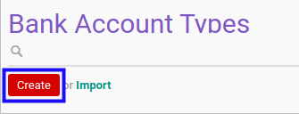

# Membuat Data Bank Account Type

## A. INPUT

*(Tidak ada instruksi khusus)*

## B. LANGKAH KERJA

1. Buka menu **Partner -> Configuration -> Banks -> Bank Account Type**. Abaikan jika sudah berada pada menu yang dimaksud.
2. Klik tombol **Create** pada bagian atas-kiri form.

3. Isi **[Name](./penjelasan.md#field-name)**. Harus diisi.
4. Isi **[Code](./penjelasan.md#field-code)**. Harus diisi.
5. Lengkapi tabel **Field Name**
6. Isi **[Field Name](./penjelasan.md#bagian-detail-fields-name)**. Harus diisi.
7. Aktifkan/ Deaktifkan **[Required](./penjelasan.md#bagian-detail-fields-required)**. Tidak harus diisi.
8. Aktifkan/ Deaktifkan **[Readonly](./penjelasan.md#bagian-detail-fields-readonly)**. Tidak harus diisi.
9. Pilih **[Bank Type](./penjelasan.md#bagian-detail-fields-bank-type-id)**. Harus diisi.
10. Isi **[Max Size](./penjelasan.md#bagian-detail-fields-size)**. Tidak harus diisi.
11. Isi **[Format Layout](./penjelasan.md#field-format-layout)**. Tidak harus diisi.
12. Klik tombol **Save** pada bagian atas-kiri form.

## C. OUTPUT

* Data bank account type akan terbuat.
