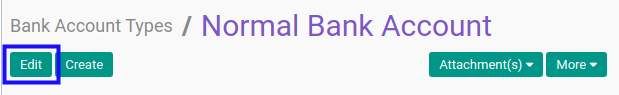

# Memodifikasi Bank Account Type

## A. INPUT

*(Tidak ada instruksi khusus)*

## B. LANGKAH KERJA

1. Buka menu **Partner -> Configuration -> Banks -> Bank Account Type**. Abaikan jika sudah berada pada menu yang dimaksud.
2. Buka data bank account type yang akan dimodifikasi. Abaikan jika data sudah dibuka.
3. Klik tombol **Edit** pada bagian atas-kiri form.

4. Isi dan sesuaikan **[Name](./penjelasan.md#field-name)** jika dibutuhkan. Harus diisi.
5. Isi dan sesuaikan **[Code](./penjelasan.md#field-code)** jika dibutuhkan. Harus diisi.
6. Lengkapi dan sesuaikan tabel **Field Name** jika dibutuhkan.
7. Isi dan sesuaikan **[Field Name](./penjelasan.md#bagian-detail-fields-name)** jika dibutuhkan. Harus diisi.
8. Aktifkan/ Deaktifkan **[Required](./penjelasan.md#bagian-detail-fields-required)** jika dibutuhkan. Tidak harus diisi.
9. Aktifkan/ Deaktifkan **[Readonly](./penjelasan.md#bagian-detail-fields-readonly)** jika dibutuhkan. Tidak harus diisi.
10. Pilih dan sesuaikan **[Bank Type](./penjelasan.md#bagian-detail-fields-bank-type-id)** jika dibutuhkan. Harus diisi.
11. Isi dan sesuaikan **[Max Size](./penjelasan.md#bagian-detail-fields-size)** jika dibutuhkan. Tidak harus diisi.
12. Isi dan sesuaikan **[Format Layout](./penjelasan.md#field-format-layout)** jika dibutuhkan. Tidak harus diisi.
13. Klik tombol **Save** pada bagian atas-kiri form.

## C. OUTPUT

* Data bank account type akan berubah sesuai dengan perubahan yang dilakukan.
