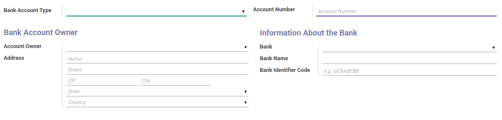

# Bank Account

### <a name="bagian-form">HEADER</a>

#### <a name="field-state">Bank Account Type</a>

Tipe akun bank

#### <a name="field-acc-number">Account Number</a>

Nomor akun bank

#### <a name="field-partner-id">Account Owner</a>

Pemilik akun bank

#### <a name="field-address">Address</a>

Alamat Bank. Terbagi atas beberapa isian, yaitu: 
* Name - Nama pemilik akun bank
* Street - Alamat akun bank
* Zip - Nomor kode POS akun bank
* City - Kota akun bank
* State - Provinsi akun bank
* Country - Negara akun bank

#### <a name="field-bank">Bank</a>

Mendefinisikan bank yang akan digunakan

#### <a name="field-bank_name">Bank Name</a>

Nama bank

#### <a name="field-bic">Bank Identifier Code</a>

Kode bank