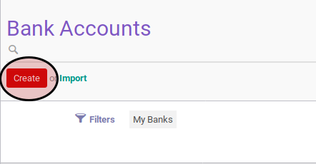
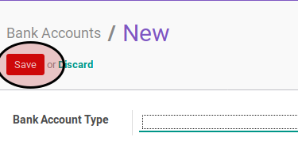

# Membuat Data Bank Account

## A. INPUT

*(Tidak ada instruksi khusus)*

## B. LANGKAH KERJA

1. Buka menu **Partner -> Configuration -> Banks -> Bank Accounts**. Abaikan jika sudah berada pada menu yang dimaksud.
2. Klik tombol **Create** pada bagian atas-kanan form.

3. Isi **Bank Account Type**. Harus diisi.
4. Isi **Account Number**. Harus diisi.
5. Lengkapi bagian **Bank Account Owner**.
6. Isi **Account Owner**. Harus diisi.
7. Isi dan sesuaikan **Name** jika dibutuhkan. Harus diisi.
8. Isi dan sesuaikan **Street** jika dibutuhkan. Tidak harus diisi.
9. Isi dan sesuaikan **Zip** jika dibutuhkan. Tidak harus diisi.
10. Isi dan sesuaikan **City** jika dibutuhkan. Tidak harus diisi.
11. Lengkapi bagian **Information About The Bank**.
12. Pilih **Bank**. Tidak harus diisi.
13. Isi dan sesuaikan **Bank Name** jika dibutuhkan. Tidak harus diisi.
14. Isi dan sesuaikan **Bank Identifier Code** jika dibutuhkan. Tidak harus diisi.
15. Klik tombol **Save** pada bagian atas-kiri form.

## C. OUTPUT

* Data bank account akan terbuat.
