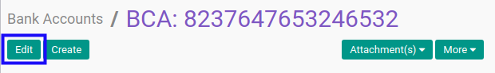
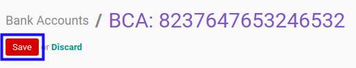

# Memodifikasi Bank Account

## A. INPUT

*(Tidak ada instruksi khusus)*

## B. LANGKAH KERJA

1. Buka menu **Partner -> Configuration -> Banks -> Bank Accounts**. Abaikan jika sudah berada pada menu yang dimaksud.
2. Buka data bank account yang akan dimodifikasi. Abaikan jika data sudah dibuka.
3. Klik tombol **Edit** pada bagian atas-kiri form.

4. Isi dan sesuaikan **[Bank Account Type](./penjelasan.md#field-state)** jika dibutuhkan. Harus diisi.
5. Isi dan sesuaikan **[Account Number](./penjelasan.md#field-acc-number)** jika dibutuhkan. Harus diisi.
6. Lengkapi dan sesuaikan bagian **Bank Account Owner** jika dibutuhkan.
7. Isi dan sesuaikan **[Account Owner](./penjelasan.md#field-partner-id)** jika dibutuhkan. Harus diisi.
8. Isi dan sesuaikan **[Name](./penjelasan.md#field-address)** jika dibutuhkan. Harus diisi.
9. Isi dan sesuaikan **[Street](./penjelasan.md#field-address)** jika dibutuhkan. Tidak harus diisi.
10. Isi dan sesuaikan **[Zip](./penjelasan.md#field-address)** jika dibutuhkan. Tidak harus diisi.
11. Isi dan sesuaikan **[City](./penjelasan.md#field-address)** jika dibutuhkan. Tidak harus diisi.
12. Lengkapi dan sesuaikan bagian **Information About The Bank** jika dibutuhkan.
13. Pilih dan sesuaikan **[Bank](./penjelasan.md#field-bank)** jika dibutuhkan. Tidak harus diisi.
14. Isi dan sesuaikan **[Bank Name](./penjelasan.md#field-bank_name)** jika dibutuhkan. Tidak harus diisi.
15. Isi dan sesuaikan **[Bank Identifier Code](./penjelasan.md#field-bic)** jika dibutuhkan. Tidak harus diisi.
16. Klik tombol **Save** pada bagian atas-kiri form.

## C. OUTPUT

* Data bank account akan berubah sesuai dengan perubahan yang dilakukan.
