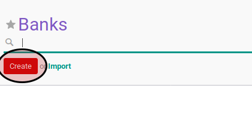
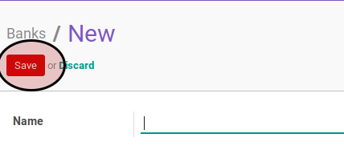

# Membuat Data Bank

## A. INPUT

*(Tidak ada instruksi khusus)*

## B. LANGKAH KERJA

1. Buka menu **Partner -> Configuration -> Banks -> Banks**. Abaikan jika sudah berada pada menu yang dimaksud.
2. Klik tombol **Create** pada bagian atas-kanan form.

3. Isi **Name**. Harus diisi.
4. Isi **Bank Identifier Code**. Tidak harus diisi.
5. Lengkapi bagian **Address**
6. Isi **Street**. Tidak harus diisi.
7. Isi **Street2**. Tidak harus diisi.
8. Isi **Zip**. Tidak harus diisi.
9. Isi **City**. Tidak harus diisi.
10. Isi **State**. Tidak harus diisi.
11. Isi **Country**. Tidak harus diisi.
12. Lengkapi bagian **Communication**.
13. Isi **Phone**. Tidak harus diisi.
14. Isi **Fax**. Tidak harus diisi.
15. Isi **Email**. Tidak harus diisi.
16. Pastikan **Active** aktif.
17. Klik tombol **Save** pada bagian atas-kiri form.

## C. OUTPUT

* Data bank akan terbuat.
