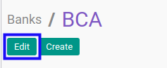
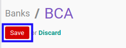

# Memodifikasi Bank

## A. INPUT

*(Tidak ada instruksi khusus)*

## B. LANGKAH KERJA

1. Buka menu **Partner -> Configuration -> Banks -> Banks**. Abaikan jika sudah berada pada menu yang dimaksud.
2. Buka data bank yang akan dimodifikasi. Abaikan jika data sudah dibuka.
3. Klik tombol **Edit** pada bagian atas-kiri form.

4. Isi dan sesuaikan **[Name](./penjelasan.md#field-name)** jika dibutuhkan. Harus diisi.
5. Isi dan sesuaikan **[Bank Identifier Code](./penjelasan.md#field-bic)** jika dibutuhkan. Tidak harus diisi.
6. Lengkapi dan sesuaikan bagian **[Address](./penjelasan.md#field-address)** jika dibutuhkan.
7. Isi dan sesuaikan **[Street](./penjelasan.md#field-address)** jika dibutuhkan. Tidak harus diisi.
8. Isi dan sesuaikan **[Street2](./penjelasan.md#field-address)** jika dibutuhkan. Tidak harus diisi.
9. Isi dan sesuaikan **[ZIP](./penjelasan.md#field-address)** jika dibutuhkan. Tidak harus diisi.
10. Isi dan sesuaikan **[City](./penjelasan.md#field-address)** jika dibutuhkan. Tidak harus diisi.
11. Isi dan sesuaikan **[State](./penjelasan.md#field-address)** jika dibutuhkan. Tidak harus diisi.
12. Isi dan sesuaikan **[Country](./penjelasan.md#field-address)** jika dibutuhkan. Tidak harus diisi.
13. Lengkapi dan sesuaikan bagian **Communication** jika dibutuhkan.
14. Isi dan sesuaikan **[Phone](./penjelasan.md#field-phone)** jika dibutuhkan. Tidak harus diisi.
15. Isi dan sesuaikan **[Fax](./penjelasan.md#field-fax)** jika dibutuhkan. Tidak harus diisi.
16. Isi dan sesuaikan **[Email](./penjelasan.md#field-email)** jika dibutuhkan. Tidak harus diisi.
17. Aktifkan/ Deaktifkan **[Active](./penjelasan.md#field-active)** jika dibutuhkan. Harus diisi.
18. Klik tombol **Save** pada bagian atas-kiri form.

## C. OUTPUT

* Data bank akan berubah sesuai dengan perubahan yang dilakukan.
