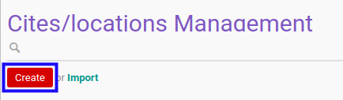
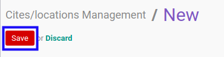

# Membuat Data Kota/Lokasi

## A. INPUT

*(Tidak ada instruksi khusus)*

## B. LANGKAH KERJA

1. Buka menu **Partner -> Configuration -> Address Book -> Localization -> Cities/Locations Management**. Abaikan jika sudah berada pada menu yang dimaksud.
2. Klik tombol **Create** pada bagian atas-kiri form.

3. Isi **[ZIP](./penjelasan.md#field-name)**. Tidak harus diisi.
4. Isi **[City Code](./penjelasan.md#field-code)**. Tidak harus diisi.
5. Isi **[City](./penjelasan.md#field-city)**. Harus diisi.
5. Pilih **[State](./penjelasan.md#field-state-id)**. Tidak harus diisi.
6. Pilih **[Country](./penjelasan.md#field-country-id)**. Tidak harus diisi.
7. Klik tombol **Save** pada bagian atas-kiri form.

## C. OUTPUT

* Data kota akan terbuat.
