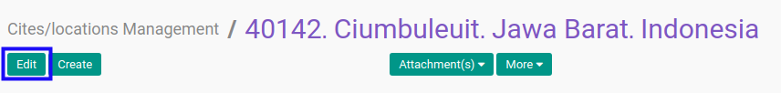
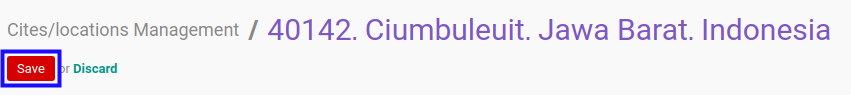

# Memodifikasi Kota/Lokasi

## A. INPUT

*(Tidak ada instruksi khusus)*

## B. LANGKAH KERJA

1. Buka menu **Partner -> Configuration -> Address Book -> Localization -> Cities/Locations Management**. Abaikan jika sudah berada pada menu yang dimaksud.
2. Buka data kota/lokasi yang akan dimodifikasi. Abaikan jika data sudah dibuka.
3. Klik tombol **Edit** pada bagian atas-kiri form.

4. Isi dan sesuaikan **[ZIP](./penjelasan.md#field-name)** jika dibutuhkan. Tidak harus diisi.
5. Isi dan sesuaikan **[City Code](./penjelasan.md#field-code)** jika dibutuhkan. Tidak harus diisi.
6. Isi dan sesuaikan **[City](./penjelasan.md#field-city)** jika dibutuhkan. Harus diisi.
7. Pilih dan sesuaikan **[State](./penjelasan.md#field-state-id)** jika dibutuhkan. Tidak harus diisi.
8. Pilih dan sesuaikan **[Country](./penjelasan.md#field-country-id)** jika dibutuhkan. Tidak harus diisi.
9. Klik tombol **Save** pada bagian atas-kiri form.

## C. OUTPUT

* Data kota/lokasi akan berubah sesuai dengan perubahan yang dilakukan.
