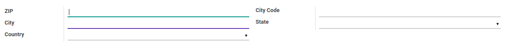

# Kota/Lokasi

### <a name="bagian-header">HEADER</a>

#### <a name="field-name">ZIP</a>

Kode pos

#### <a name="field-code">City Code</a>

Kode kota/lokasi

#### <a name="field-city">City</a>

Nama kota/lokasi

#### <a name="field-state-id">State</a>

Propinsi kota/lokasi

#### <a name="field-country-id">Country</a>

Negara kota/lokasi
