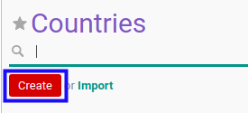
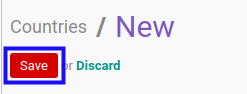

# Membuat Data Negara

## A. INPUT

*(Tidak ada instruksi khusus)*

## B. LANGKAH KERJA

1. Buka menu **Partner -> Configuration -> Address Book -> Localization -> Countries**. Abaikan jika sudah berada pada menu yang dimaksud.
2. Klik tombol **Create** pada bagian atas-kiri form.

3. Isi **[Country Name](./penjelasan.md#field-name)**. Harus diisi.
4. Isi **[Country Code](./penjelasan.md#field-code)**. Tidak harus diisi.
5. Pilih **[Currency](./penjelasan.md#field-currency-id)**. Tidak harus diisi.
6. Isi **[Address Format](./penjelasan.md#field-address-format)**. Tidak harus diisi.
7. Klik tombol **Save** pada bagian atas-kiri form.

## C. OUTPUT

* Data negara akan terbuat.
