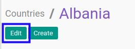
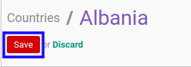

# Memodifikasi Negara

## A. INPUT

*(Tidak ada instruksi khusus)*

## B. LANGKAH KERJA

1. Buka menu **Partner -> Configuration -> Address Book -> Localization -> Countries**. Abaikan jika sudah berada pada menu yang dimaksud.
2. Buka data negara yang akan dimodifikasi. Abaikan jika data sudah dibuka.
3. Klik tombol **Edit** pada bagian atas-kiri form.

4. Isi dan sesuaikan **[Country Name](./penjelasan.md#field-name)** jika dibutuhkan. Harus diisi.
5. Isi dan sesuaikan **[Country Code](./penjelasan.md#field-code)** jika dibutuhkan. Tidak harus diisi.
6. Pilih dan sesuaikan **[Currency](./penjelasan.md#field-currency-id)** jika dibutuhkan. Tidak harus diisi.
7. Isi dan sesuaikan **[Address Format](./penjelasan.md#field-address-format)** jika dibutuhkan. Tidak harus diisi.
8. Klik tombol **Save** pada bagian atas-kiri form.

## C. OUTPUT

* Data negara akan berubah sesuai dengan perubahan yang dilakukan.
